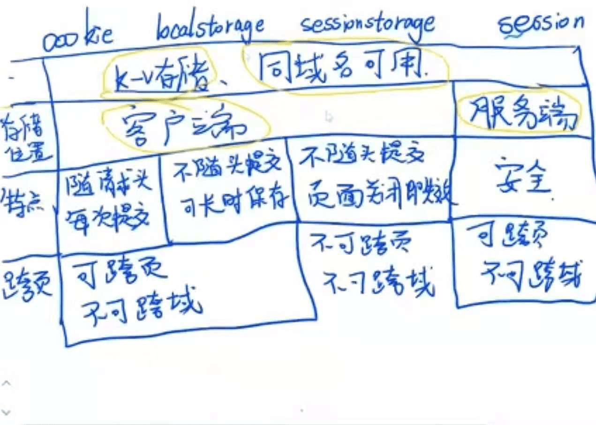

* https://www.bilibili.com/video/BV1ut411j7R7?p=1&share_medium=android&share_plat=android&share_source=WEIXIN&share_tag=s_i&timestamp=1625186472&unique_k=9w2u7I
* 

* tookie,session,token,  https://www.bilibili.com/video/BV1Tr4y1M7HA?p=1&share_medium=android&share_plat=android&share_source=WEIXIN&share_tag=s_i&timestamp=1625186773&unique_k=7PuAUv
* 
* 
* https://www.cnblogs.com/qiujianmei/p/10824682.html

* Cookie是服务器发送到浏览器的一小段数据，会在浏览器下次向同一服务器再发起请求时被携带并发送到服务器上。

| **存储方式**   | **作用与特性**                                               | **存储数量及大小**                                           | **api**                                                      |
| -------------- | ------------------------------------------------------------ | ------------------------------------------------------------ | ------------------------------------------------------------ |
| cookie         | ● 存储用户信息，获取数据需要与服务器建立连接。
● 可存储的数据有限，且依赖于服务器，无需请求服务器的数据尽量不要存放在cookie中，以免影响页面性能。
● 可设置过期时间。 | ● 最好将cookie控制在4095B以内，超出的数据会被忽略。● IE6或更低版本最多存20个cookie； IE7及以上版本最多可以有50个；Firefox最多50个；chrome和Safari没有做硬性限制。 | 原生、$.cookie（详见上文）                                   |
| localStorage   | ● 存储客户端信息，无需请求服务器。● 数据永久保存，除非用户手动清理客户端缓存。● 开发者可自行封装一个方法，设置失效时间。 | 5M左右，各浏览器的存储空间有差异。（感兴趣的同学可以自己试一下）。 | // 保存数据到 localStoragelocalStorage.setItem('key', 'value');// 从 localStorage 获取数据let data = localStorage.getItem('key');// 从 localStorage 删除保存的数据localStorage.removeItem('key');// 从 localStorage 删除所有保存的数据localStorage.clear(); |
| sessionStorage | ● 存储客户端信息，无需请求服务器。● 数据保存在当前会话，刷新页面数据不会被清除，结束会话（关闭浏览器、关闭页面、跳转页面）数据失效。 | 同localStorage                                               | // 保存数据到 sessionStoragesessionStorage.setItem('key', 'value');// 从 sessionStorage 获取数据let data = sessionStorage.getItem('key');// 从 sessionStorage 删除保存的数据sessionStorage.removeItem('key');// 从 sessionStorage 删除所有保存的数据sessionStorage.clear(); |