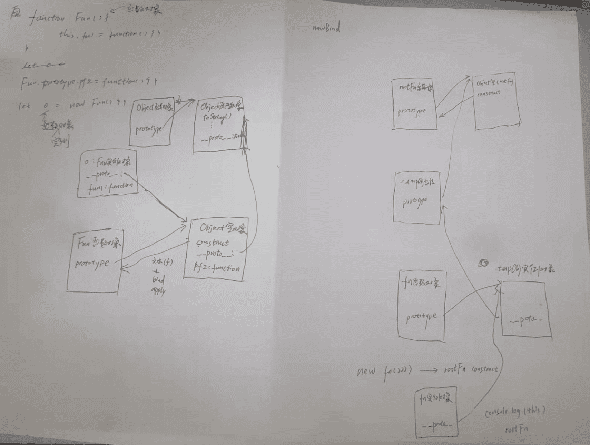

从零开始js模块化规范
* 项目路径 /Users/hfb/projects/js/jsmodulelet
* bilibili : js模块化规范
* js模块化分类
    * commonjs: require
    * amd:
    * cmd: 很少用
    * es6: import
    * umd: (是commonjs和amd的兼容)
``` bash
Since CommonJS and AMD styles have both been equally popular, it seems there’s yet no consensus. This has brought about the push for a “universal” pattern that supports both styles, which brings us to none other than the Universal Module Definition.

```


从零开始js日常主题测试
* 项目路径 /Users/hfb/projects/js/jsmodulelet
``` bash
[js原型和原型链]   1. prototype: 定义函数时      2. __proto__: 创建对象时自动添加的
​```js
function Fun() {
  this.fn1 = function () {};
}
Fun.prototype.pf2 = function () {};
let o = new Fun();
```
- 有 5 个实体去理解
  - Object 函数对象(prototype)
  - Object 原型对象
  - o:Fun 实例对象
  - Object 空对象
  - Fun 函数对象
  - bind,apply 等函数是在 Object 空对象(constructor)函数里面->附在 prototype 上面
```
* 2_执行上下文与执行


- 3_Promise 和 setTimeOut 宏任务和微任务(js 执行顺序问题)
  - promise 比 setTimeout 先执行,因为这是微任务
  - promise 的 then 函数可以套很多层


```


- 4\_手写 Newbind 加深理解
  - 4.1 bind 是绑定 this 的指向并返回新的函数




[手写newBind] 加深理解 prototype __proto__ arguments apply等函数

* bind 函数的 3 个特点
- 1.绑定 this,返回一个函数
- 2.可以传入参数
- bind 返回的函数.
- 作为构造函数生成新对象时,其 this 失效