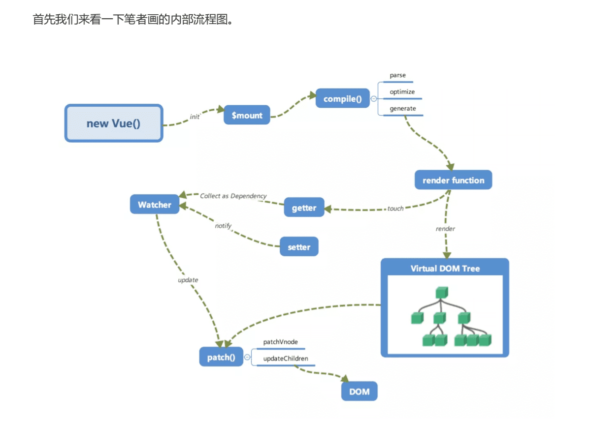

::: tip 简介
1, 掌握原理深刻理解会事半功倍
:::

书籍pdf 地址
``` bash 
/Users/hfb/Documents/1js/Vue内部运行机制/剖析+Vue.js+内部运行机制@www.java1234.com.pdf
```

配套的代码
``` bash 
cd /Users/hfb/Documents/1js/Vue内部运行机制/VueDemo 
```


概要流程图:




