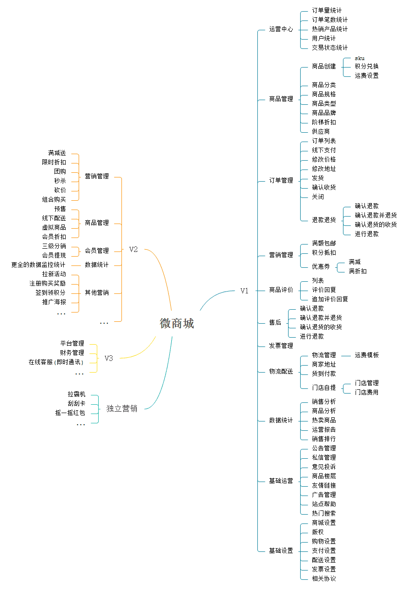

::: tip 参考学习其前端代码, 后端代码一体化php方案已经过时  
1, 参考学习其前端代码

2, 后端代码一体化php方案已经过时 `不分离` `维护成本高`
:::


h5调起所有功能:帐号和密码
``` bash
17719450257
123456
```

[前端git项目地址](https://github.com/stavyan/TinyShop-UniApp)
# 前端学习参考
前端基于 uni-app，一端发布多端通用，目前已经适配 H5、微信小程序、QQ小程序、Ios App、Android App。目前开源的版本功能为 V1 版，更多增强功能(V2、V3)敬请期待。

``` bash
cd /Users/hfb/projects/js/vue/TinyShop-UniApp
```


# RageFrame 2.0  (后台 php`并非前后端分离模式`)
[git地址](https://github.com/jianyan74/rageframe2)


# 微商城产品 思维导图内容


