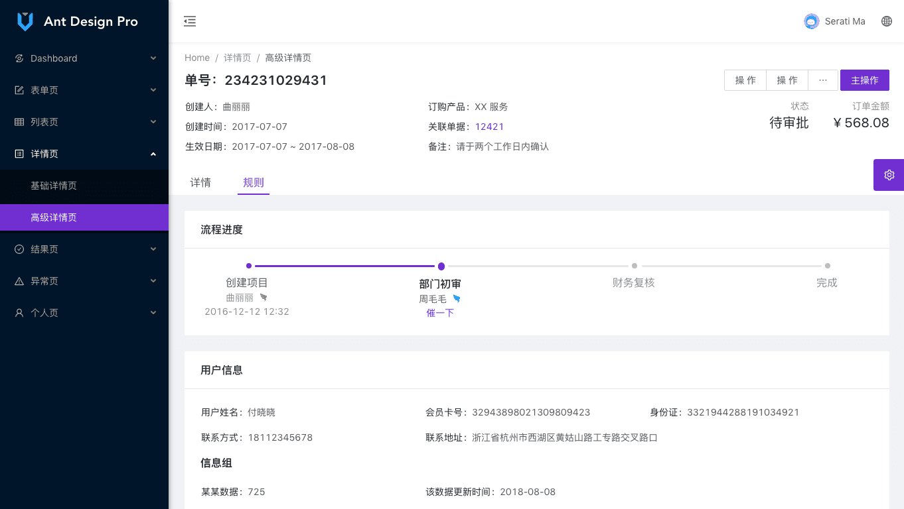
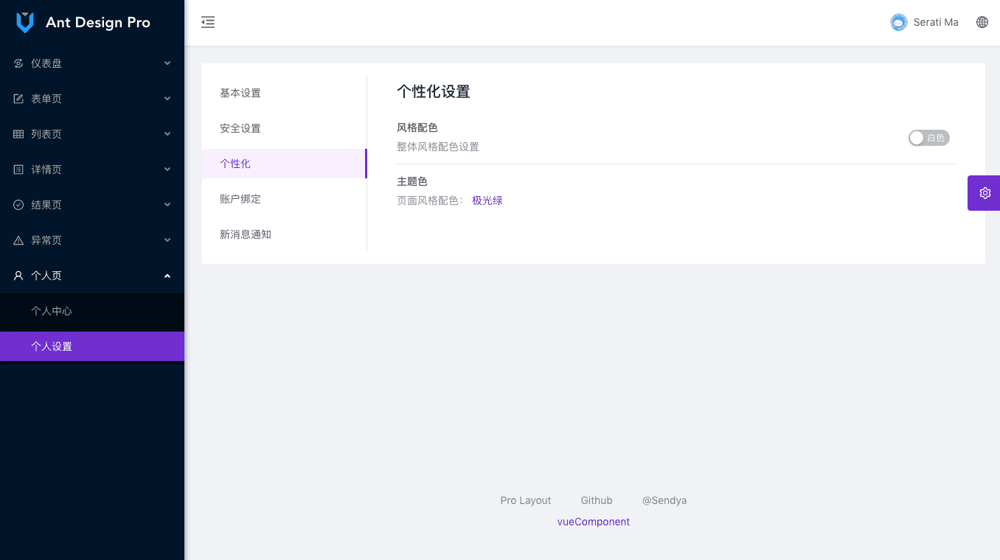

::: tip antd是一个后台常用的设计
1, 如下有几张效果图
:::


[组件库官网](https://www.antdv.com/docs/vue/introduce-cn/)


[项目git路径]https://github.com/vueComponent/ant-design-vue-pro.git


项目本地路径
``` bash
cd /Users/hfb/projects/js/vue/ant-design-vue-pro
yarn run serve
```


[AntVuePro介绍视频(约1小时)](https://www.bilibili.com/video/BV1xc411h7d2?from=search&seid=5439392562628504352)

[通过vue官方脚手架安装:手工模式1-less样式](https://www.bilibili.com/video/BV1Vt4y1U71x)

[手动搭建:手工模式2-路由和layout与views的规划,,路由和懒加载](https://www.bilibili.com/video/BV1Na4y1t79n)

`SPA单页面应用 single page app`


[定制Antd主题](https://ant.design/docs/react/customize-theme-cn#header)


效果图如下:





