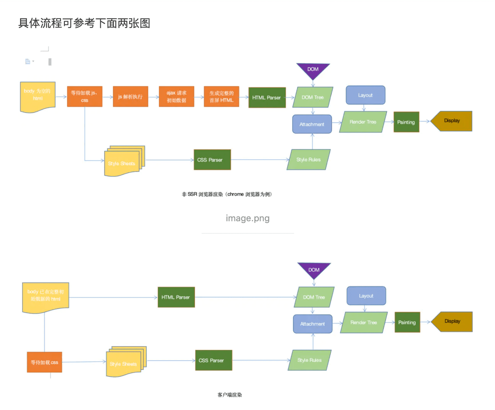

[链接原文](https://www.jianshu.com/p/10b6074d772c)

SSR是 Server-Side Rendering(服务器端渲染)
SEO（Search Engine Optimization）
* 到底什么是SPA、SEO、SSR？ https://blog.csdn.net/weixin_42941619/article/details/88680053

# SSR的优势
1. 更利于SEO。

不同爬虫工作原理类似，只会爬取源码，不会执行网站的任何脚本（Google除外，据说Googlebot可以运行javaScript）。使用了React或者其它MVVM框架之后，页面大多数DOM元素都是在客户端根据js动态生成，可供爬虫抓取分析的内容大大减少(如图一)。另外，浏览器爬虫不会等待我们的数据完成之后再去抓取我们的页面数据。服务端渲染返回给客户端的是已经获取了异步数据并执行JavaScript脚本的最终HTML，网络爬中就可以抓取到完整页面的信息。

2. 更利于首屏渲染

首屏的渲染是node发送过来的html字符串，并不依赖于js文件了，这就会使用户更快的看到页面的内容。尤其是针对大型单页应用，打包后文件体积比较大，普通客户端渲染加载所有所需文件时间较长，首页就会有一个很长的白屏等待时间。

# SSR的局限
服务端压力较大
本来是通过客户端完成渲染，现在统一到服务端node服务去做。尤其是高并发访问的情况，会大量占用服务端CPU资源；

开发条件受限
在服务端渲染中，只会执行到componentDidMount之前的生命周期钩子，因此项目引用的第三方的库也不可用其它生命周期钩子，这对引用库的选择产生了很大的限制；

学习成本相对较高
除了对webpack、React要熟悉，还需要掌握node、Koa2等相关技术。相对于客户端渲染，项目构建、部署过程更加复杂。

[Vue SSR 指南](https://ssr.vuejs.org/zh/#%E4%BB%80%E4%B9%88%E6%98%AF%E6%9C%8D%E5%8A%A1%E5%99%A8%E7%AB%AF%E6%B8%B2%E6%9F%93-ssr-%EF%BC%9F)

:::tip 注意
本指南需要最低为如下版本的 Vue，以及以下 library 支持：
* vue & vue-server-renderer 2.3.0+
* vue-router 2.5.0+
* vue-loader 12.0.0+ & vue-style-loader 3.0.0+

如果先前已经使用过 Vue 2.2 的服务器端渲染 (SSR)，你应该注意到，推荐的代码结构现在略有不同（使用新的 runInNewContext 选项，并设置为 false）。现有的应用程序可以继续运行，但建议你迁移到新的推荐规范。
:::

::: tip 理解需求
如果你调研服务器端渲染 (SSR) 只是用来改善少数营销页面（例如 /, /about, /contact 等）的 SEO，那么你可能需要预渲染。无需使用 web 服务器实时动态编译 HTML，而是使用预渲染方式，在构建时 (build time) 简单地生成针对特定路由的静态 HTML 文件。优点是设置预渲染更简单，并可以将你的前端作为一个完全静态的站点。
:::

