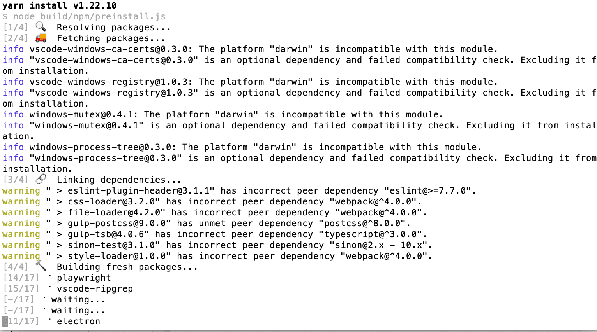
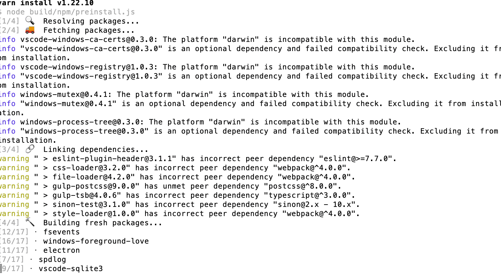
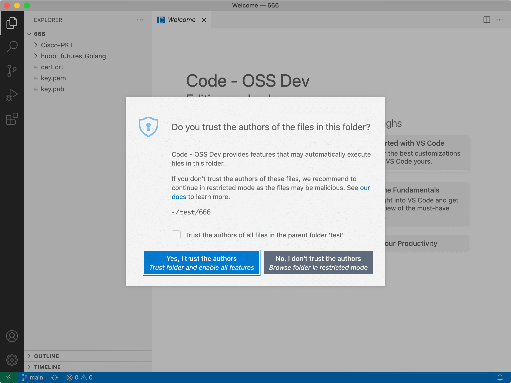

* vscode源码目录  源码编译vscode
  * /Users/hfb/projects/js/vscode


``` bash
#第一次运行,会要求下载electron对应的版本,443端口的外网访问如何解决??  250kB速度下500秒左右(那约120MB的包大小)
cd /Users/hfb/projects/js/vscode
./scripts/code.sh
# 下载完100%后,手动中断以后 Reason: image not found
```

* 编译为 app:   在源码项目目录下: gulp vscode-darwin-x64
* 生成的app在源码目录的上一级目录


* vscode所需要的依赖包






