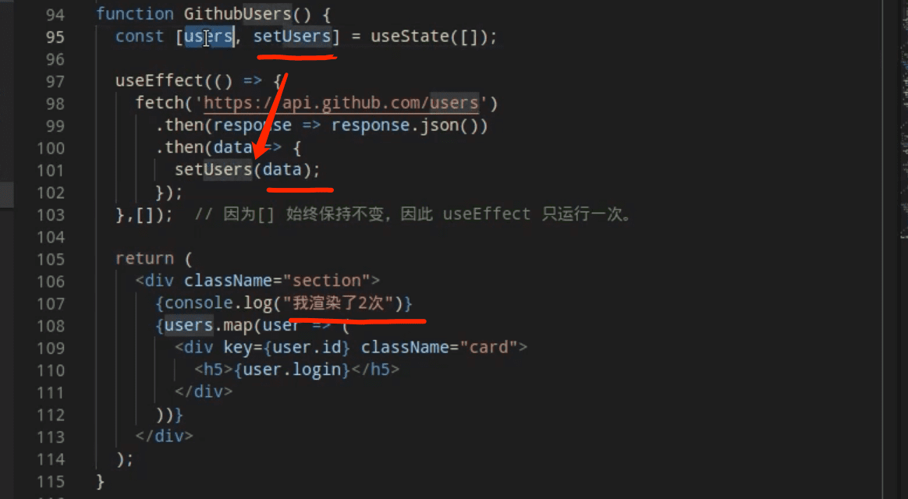
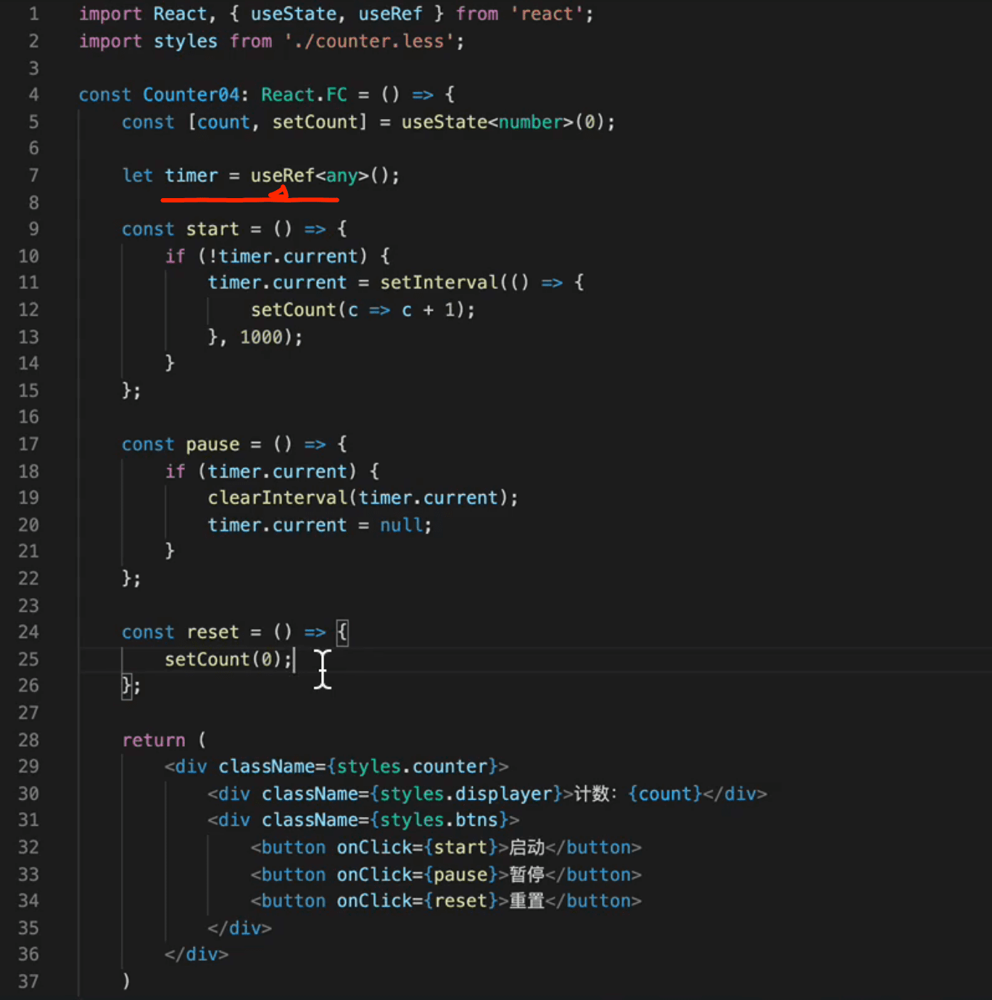

React-redux

[15分钟react-redux](https://www.bilibili.com/video/BV1n4411Z79W?from=search&seid=12883883152405349876)

::: tip  react hook 什么是Hook

[react 16.7 hook概述](https://www.jianshu.com/p/e61faf452565)

钩子是允许从功能组件(function component)“挂钩”React状态和生命周期功能的功能。钩子在类内部不起作用 - 它们允许你在没有类的情况下使用React。 (我们不建议你在一夜之间重写现有组件，但如果你愿意，可以开始在新组件中使用Hook。）

:::

[Hook React hooks React Hook 16.12版本新特性Hook详解](https://www.bilibili.com/video/BV1VE411w7wi?from=search&seid=4874220794429879918)

useState示例

useRef示例  [视频地址](https://www.bilibili.com/video/BV1Tv41117fn?from=search&seid=16539574206686725215)

