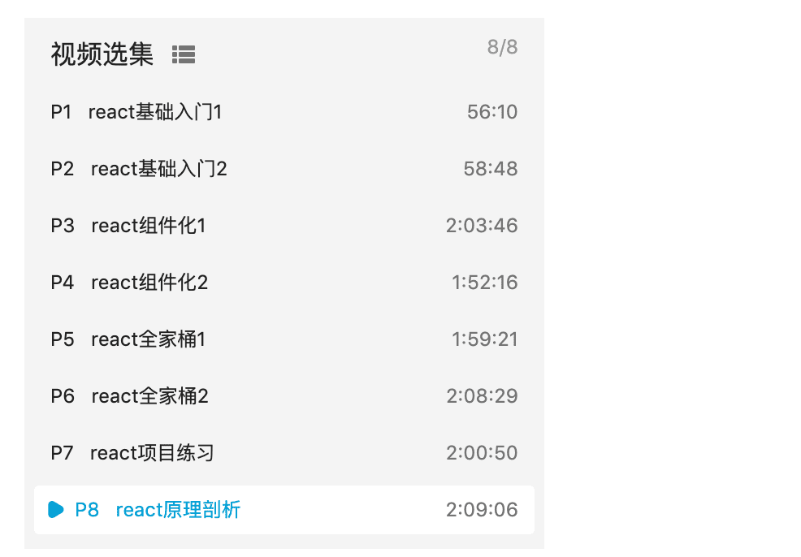

::: tip 开课吧一个系列的React教程
特点: 

1. `规范` 或者 `范式` 比较标准

2. 有进阶部分 react封装原理

:::


高阶组件
[视频地址](https://www.bilibili.com/video/BV1AE411x7mL?p=8)




本地代码的路径

``` bash
/Users/hfb/projects/js/react/57code/react01
```


github路径
``` bash
https://github.com/57code/react01
```
