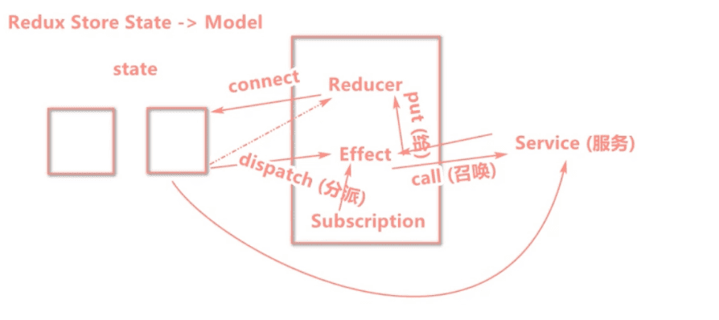

::: tip 为什么用umi 作为脚手架
antd pro 推荐使用的
::: 

Umi，中文可发音为乌米


[umi官网配置项说明](https://umijs.org/zh-CN/config#base)


项目地址

``` bash
/Users/hfb/projects/js/react/reactukforcomp
```


# 视频学习资料
[umi项目视频学习课程](https://www.bilibili.com/video/BV1qz411z7s3?p=6)





