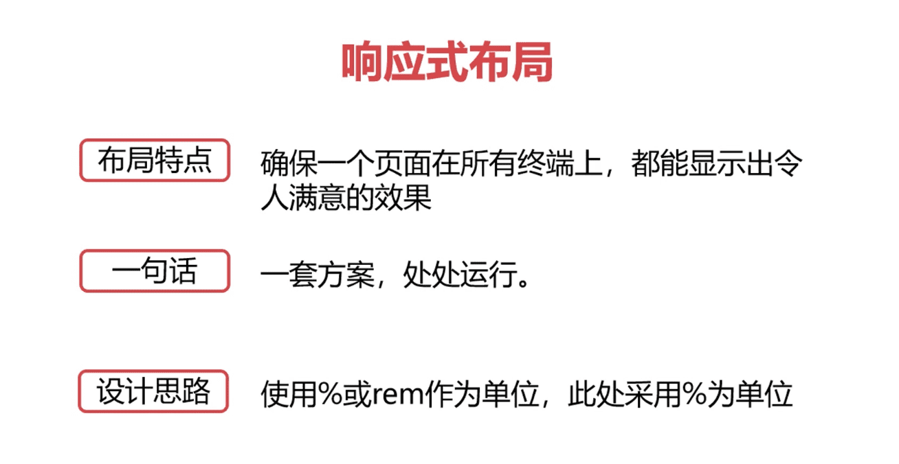

[视频学习地址](https://www.bilibili.com/video/BV1ov411k7sm?from=search&seid=16860565878954994085)

解决问题

* 页面设计在不同设备的显示情况
* 布局只用float+定位,不使用flex
* 不能很好的使用rem作为设计单位
* 掌握响应式布局,弹性等等常见布局

六个案例学会响应式布局

* P1 课程介绍 04:25
* P2 什么是媒体查询 07:16
* P3 @media常用参数 10:15
* P4 媒体查询其他引入方式-1 04:49
* P5 媒体查询其他引入方式-2 04:11
* P6 什么是flex 03:28
* P7 主轴方向与换行 10:39
* P8 剩余空间调整为间距 03:31
* P9 交叉轴的对齐方式 05:18
* P10 给子元素设置伸缩比例flex属性 13:38
* P11 给子元素设置伸缩的特殊写法 06:22
* P12 课堂案例1-输入框布局 07:16
* P13 课堂案例2-长表单布局 10:50
* P14 课堂案例3-rem的使用方法 13:43
* P15 课堂案例4-自适应布局 11:48
* P16 课堂案例5-响应式布局 25:33
* P17 课堂案例6-rem弹性布局 16:14
* P18 课程小结 03:14

