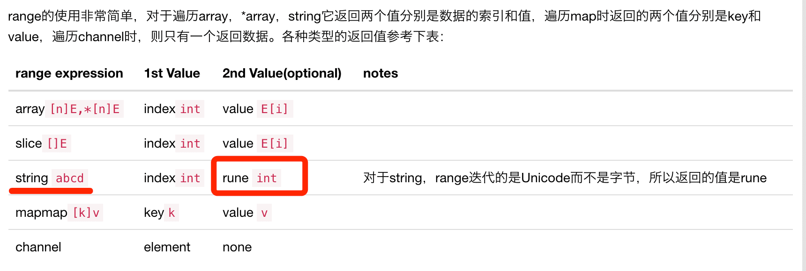

可能被忽略的Golang细节——range

range的使用
range的使用非常简单，对于遍历array，*array，string它返回两个值分别是数据的索引和值，遍历map时返回的两个值分别是key和value，遍历channel时，则只有一个返回数据。各种类型的返回值参考下表：

*  range expression	1st Value	2nd Value(optional)	notes
*  array[n]E,*[n]E	indexint	value E[i]	
*  slice[]E	indexint	value E[i]	
*  string abcd	indexint	rune int	对于string，range迭代的是Unicode而不是字节，所以返回的值是rune
*  mapmap[k]v	keyk	value v	
*  channel	element	none	

[参考链接](https://studygolang.com/articles/20049)

