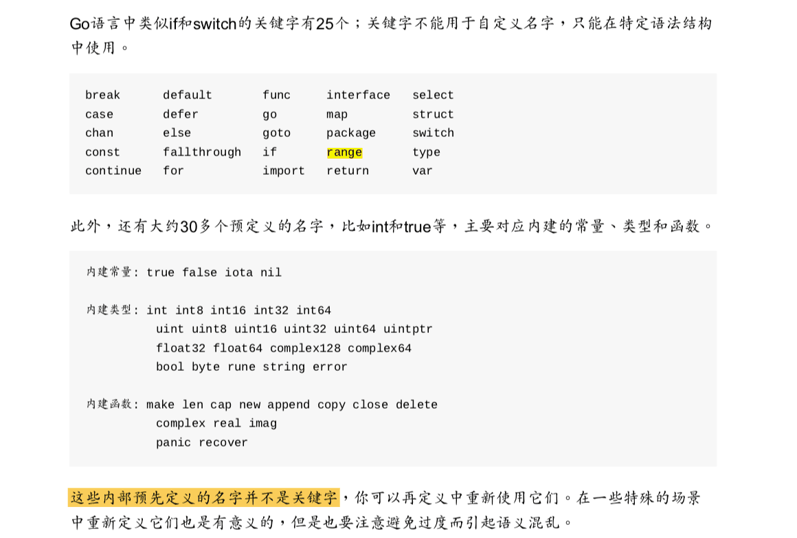

## golang 25个关键字

*  var和const ：变量和常量的声明
*  var varName type  或者 varName : = value
*  package and import: 导入
*  func： 用于定义函数和方法
*  return ：用于从函数返回
*  defer someCode ：在函数退出之前执行
*  go : 用于并行
*  select 用于选择不同类型的通讯
*  interface 用于定义接口
*  struct 用于定义抽象数据类型
*  break、case、continue、for、fallthrough、else、if、switch、goto、default 流程控制
*  chan用于channel通讯
*  type用于声明自定义类型
*  map用于声明map类型数据
*  range用于读取slice、map、channel数据

## golang 内建类型
*  内置字符串类型：string.
*  内置布尔类型：bool.
*  内置数值类型：
*  int8、uint8（byte）、int16、uint16、int32（rune）、uint32、int64、uint64、int、uint、uintptr。
*  float32、float64。
*  complex64、complex128。
*  注意，byte是uint8的一个内置别名，rune是int32的一个内置别名。 下面将要提到如何声明自定义的类型别名。

`我们可以用unsafe标准库包中的Sizeof函数来取得任何一个值的尺寸`

`[参考go语言经典]`

[参考链接2](https://gfw.go101.org/article/type-system-overview.html#:~:text=%E5%86%85%E7%BD%AE%E6%95%B0%E5%80%BC%E7%B1%BB%E5%9E%8B%EF%BC%9A,complex64%20%E3%80%81%20complex128%20%E3%80%82)

## golang 数据类型  
*  `基础类型` `复合类型` `引用类型` `接口类型`

*  基础类型
*  `数字` `字符串` `布尔`
*  复合类型
*  `数组` `结构体`
*  引用类型  (它们都是对程序中变量或者状态的间接引用,`数据修改会影响所有该引用的拷贝`)
*  `指针` `切片` `字典` `函数` `通道` 
*  接口类型
*  