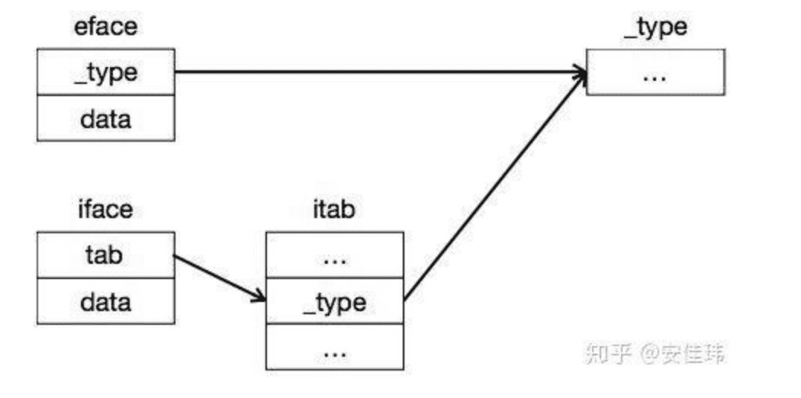
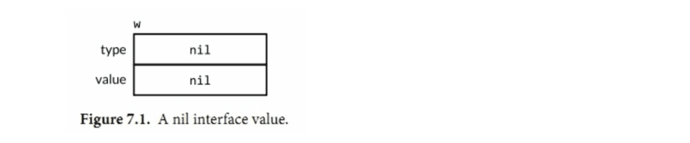

## [interface原理分析参考链接](https://www.cnblogs.com/anjiawei/p/10664978.html)

## [参考链接2](https://github.com/qcrao/Go-Questions/blob/master/interface/iface%20%E5%92%8C%20eface%20%E7%9A%84%E5%8C%BA%E5%88%AB%E6%98%AF%E4%BB%80%E4%B9%88.md)

## [汇编视角3](http://legendtkl.com/2017/07/01/golang-interface-implement/)

## [参考链接4](http://legendtkl.com/2017/06/12/understanding-golang-interface/)

## interface 的数据结构

* `eface` 表示空的 `interface{}` ，它用两个机器字长表示，第一个字 _type 是指向实际类型描述的指针，第二个字 data 代表数据指针。
* `iface` 表示至少带有一个函数的 interface， 它也用两个机器字长表示，第一个字 tab 指向一个 itab 结构，第二个字 data 代表数据指针。

## reflect包

