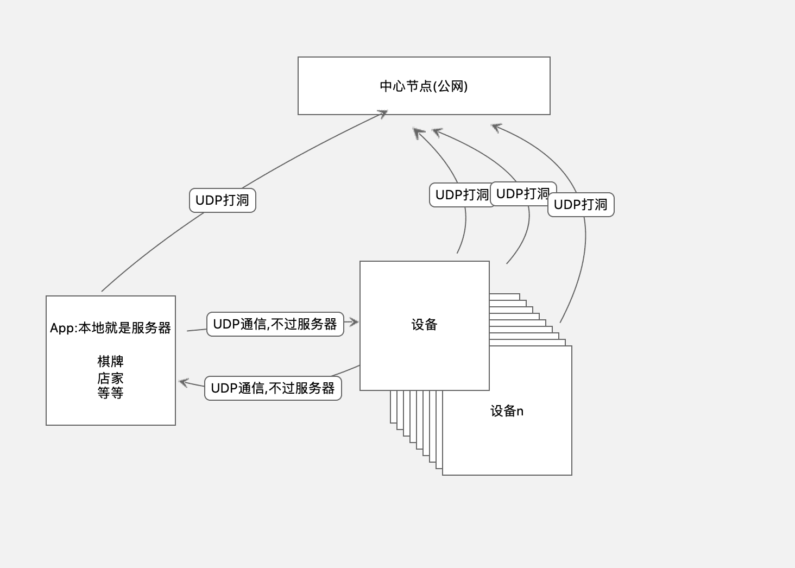
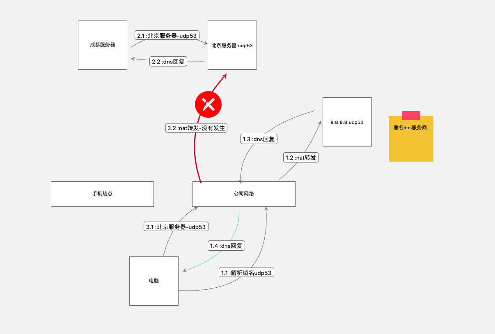

结论: 不可行!!! udp各种拦截加丢弃,运营商那还有一层防火墙了

项目路径
```
cd /Users/hfb/projects/docs/workingnote
gowatch
```


应用场景:减轻公网节点的流量压力,尽量p2p进行:手柄操作


[原文链接](https://blog.csdn.net/qq_31967569/article/details/82704340)


``` bash

                        Server S
                    207.148.70.129:9981
                           |
                           |
    +----------------------|----------------------+
    |                                             |
  NAT A                                         NAT B
120.27.209.161:6000                            120.26.10.118:3000
    |                                             |
    |                                             |
 Client A                                      Client B
  10.0.0.1:9982                                 192.168.0.1:9982

```





[打洞过程见另一文章](https://blog.csdn.net/chenlycly/article/details/52344405)



