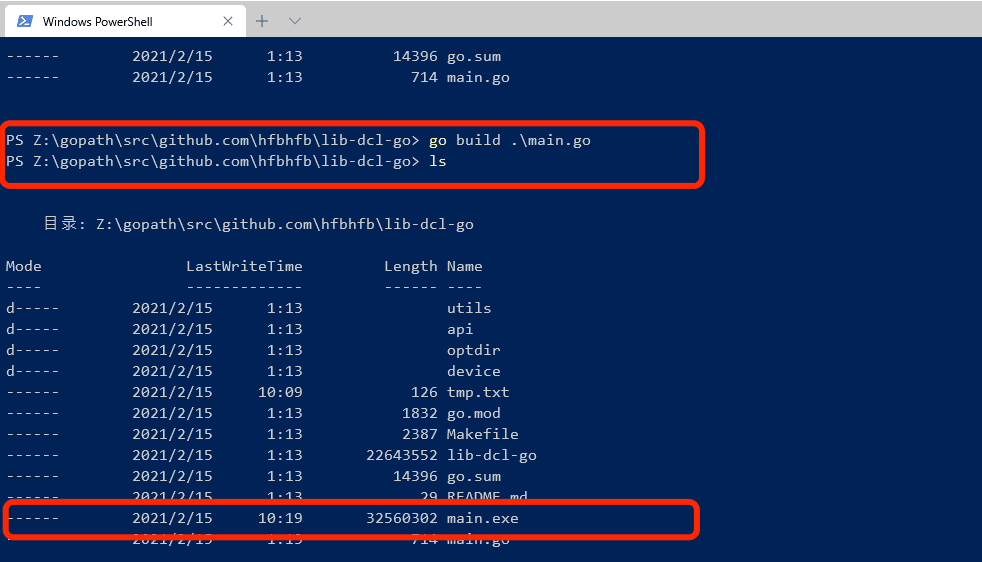

---

title: windows下go安装
date: 2021-02-15 00:45:05
permalink: /pages/c2db0d/
categories:
  - 后端
  - golang
tags:
  - 
---

[参考链接](https://www.cnblogs.com/ynhmonster/p/8335797.html)

[百度百科MinGW，是Minimalist GNUfor Windows的缩写](https://baike.baidu.com/item/mingw/1777782?fr=aladdin)

[Mingw-w64在win10下的安装使用](https://www.jianshu.com/p/a6e0d1465491)

::: tip
最常用的免费可用的编译器是 GNU 的 C/C++ 编译器，为了在 Windows 上安装 GCC，您需要安装 MinGW，安装MinGW之后的windows系统便有了linux系统的感觉，可以直接使用make，gcc，ls等命令直接进行操作。
:::

[解决：cc1.exe: sorry, unimplemented: 64-bit mode not compiled in](https://blog.csdn.net/sinat_32023305/article/details/80747046)

解决windows编译的问题

