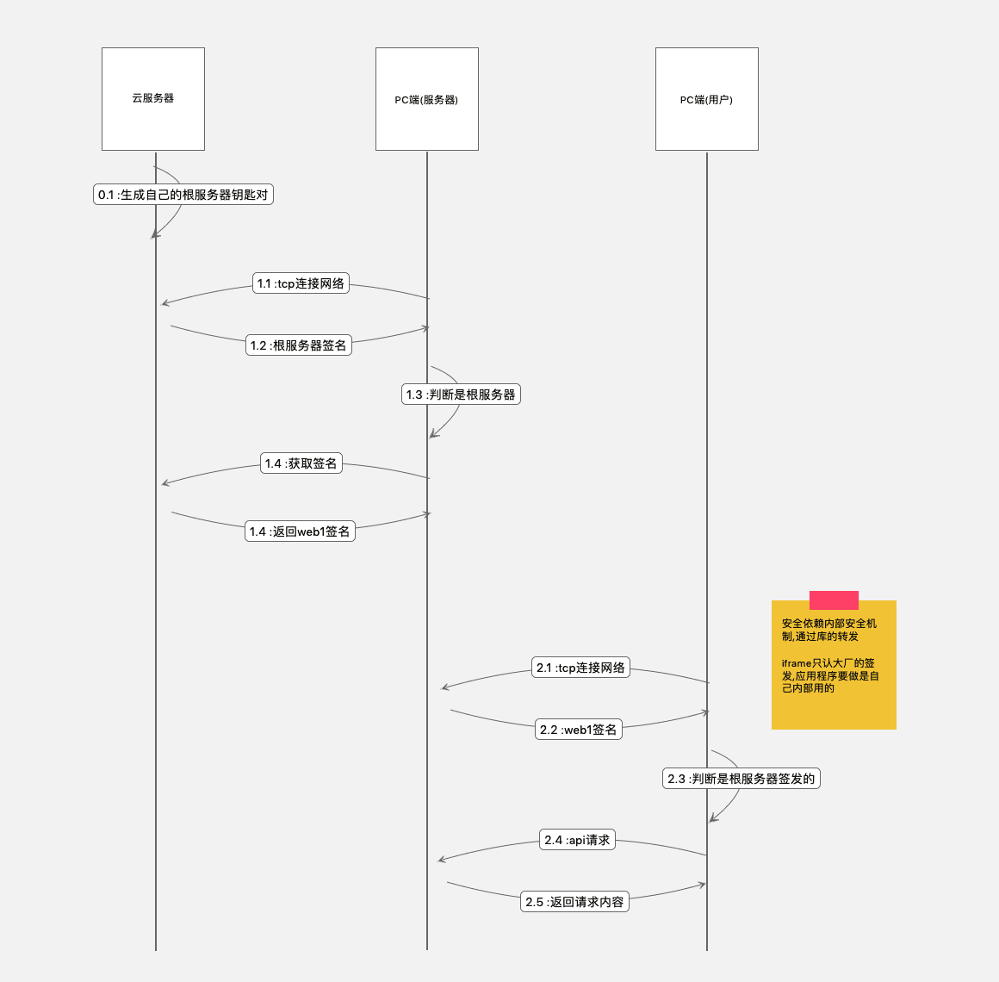

项目代码参考目录
``` bash
cat /Users/hfb/projects/go/gopath/src_only_mod_copy/github.com/hfbhfb/lib-dcl-go/utils/secure/httpsrsagen_test.go
```

生成根证书
``` bash
openssl genrsa -out key.pem 2048
openssl rsa -in key.pem -pubout -out key.pub
openssl req -x509 -new -days 36500 -key key.pem -out cert.crt
```





[go生成证书](https://segmentfault.com/a/1190000009666888)


自己的根证书的信息
``` json
{
    "Raw":"MIIDPjCCAiYCCQCBwDO5cIzO/TANBgkqhkiG9w0BAQsFADBhMQswCQYDVQQGEwJhYTELMAkGA1UECAwCYWExCzAJBgNVBAcMAmFhMQswCQYDVQQKDAJhYTELMAkGA1UECwwCYWExCzAJBgNVBAMMAmFhMREwDwYJKoZIhvcNAQkBFgJhYTAeFw0yMTAyMjgwNDEyNDdaFw0yMjAyMjgwNDEyNDdaMGExCzAJBgNVBAYTAmFhMQswCQYDVQQIDAJhYTELMAkGA1UEBwwCYWExCzAJBgNVBAoMAmFhMQswCQYDVQQLDAJhYTELMAkGA1UEAwwCYWExETAPBgkqhkiG9w0BCQEWAmFhMIIBIjANBgkqhkiG9w0BAQEFAAOCAQ8AMIIBCgKCAQEAutzqd6srCa5MEQ4/P4bYpinIx+zCk18GO3vf8mcF/cEQZwEkF6uP9pyRqQzpF4Eh28f4elOwIQbcKLK0RudZfbhv2MW81EGsjsXgbxKjcow0xqXYJgiGuUHYVXo8frj7xgx/RVj+sluHmlLwlGb5yCxfP84HGL1lfWMLoDT4DN9F2c4CYXigX8MuviPLGufmYzOtmQrkkltsgFT7+HO04EXKlJscD7k/tlAnoqsfKrazjjbynG4tTEsOsjyh41nLaE6B485AnX9X823Jw9kDbwXnwht2uS8ZFYm8ZhT7biX1a9zY+X5Klr/1AgZZ8+IyVPcNCP3oEp9KKnpIhnN+awIDAQABMA0GCSqGSIb3DQEBCwUAA4IBAQAo7oaqCg0wNgexrtYUeQ/v5hywIVZr8sWzWB+YA+aXD8OBa09ZbQJCDVuu4/wyYONidS3izv09xgYS8kMjHt5aAsQN/pObGmjIetLZkutEb7i0ciISu6ylEk3JeZ9HpYjWcFnyelQs8Fq2PjYVsSyOA0sTjmO6e87xU1jYhitcr7uD9N2xQszSFUWXp/NlyD/7zPmhWPdm+pcWYJOnx72V3sSYnt6ITTLcFbCYR4vwq0UpnnrLhwYcMkBAhew1F29vRuxu8jIQamQmuZrI1tnPg3gdYWIQSh5OTuaGI11igyWZ8NtArH4rBE4qcX6vhFQUchaeXUEG9t7eskHgix8r",
    "RawTBSCertificate":"MIICJgIJAIHAM7lwjM79MA0GCSqGSIb3DQEBCwUAMGExCzAJBgNVBAYTAmFhMQswCQYDVQQIDAJhYTELMAkGA1UEBwwCYWExCzAJBgNVBAoMAmFhMQswCQYDVQQLDAJhYTELMAkGA1UEAwwCYWExETAPBgkqhkiG9w0BCQEWAmFhMB4XDTIxMDIyODA0MTI0N1oXDTIyMDIyODA0MTI0N1owYTELMAkGA1UEBhMCYWExCzAJBgNVBAgMAmFhMQswCQYDVQQHDAJhYTELMAkGA1UECgwCYWExCzAJBgNVBAsMAmFhMQswCQYDVQQDDAJhYTERMA8GCSqGSIb3DQEJARYCYWEwggEiMA0GCSqGSIb3DQEBAQUAA4IBDwAwggEKAoIBAQC63Op3qysJrkwRDj8/htimKcjH7MKTXwY7e9/yZwX9wRBnASQXq4/2nJGpDOkXgSHbx/h6U7AhBtwosrRG51l9uG/YxbzUQayOxeBvEqNyjDTGpdgmCIa5QdhVejx+uPvGDH9FWP6yW4eaUvCUZvnILF8/zgcYvWV9YwugNPgM30XZzgJheKBfwy6+I8sa5+ZjM62ZCuSSW2yAVPv4c7TgRcqUmxwPuT+2UCeiqx8qtrOONvKcbi1MSw6yPKHjWctoToHjzkCdf1fzbcnD2QNvBefCG3a5LxkVibxmFPtuJfVr3Nj5fkqWv/UCBlnz4jJU9w0I/egSn0oqekiGc35rAgMBAAE=",
    "RawSubjectPublicKeyInfo":"MIIBIjANBgkqhkiG9w0BAQEFAAOCAQ8AMIIBCgKCAQEAutzqd6srCa5MEQ4/P4bYpinIx+zCk18GO3vf8mcF/cEQZwEkF6uP9pyRqQzpF4Eh28f4elOwIQbcKLK0RudZfbhv2MW81EGsjsXgbxKjcow0xqXYJgiGuUHYVXo8frj7xgx/RVj+sluHmlLwlGb5yCxfP84HGL1lfWMLoDT4DN9F2c4CYXigX8MuviPLGufmYzOtmQrkkltsgFT7+HO04EXKlJscD7k/tlAnoqsfKrazjjbynG4tTEsOsjyh41nLaE6B485AnX9X823Jw9kDbwXnwht2uS8ZFYm8ZhT7biX1a9zY+X5Klr/1AgZZ8+IyVPcNCP3oEp9KKnpIhnN+awIDAQAB",
    "RawSubject":"MGExCzAJBgNVBAYTAmFhMQswCQYDVQQIDAJhYTELMAkGA1UEBwwCYWExCzAJBgNVBAoMAmFhMQswCQYDVQQLDAJhYTELMAkGA1UEAwwCYWExETAPBgkqhkiG9w0BCQEWAmFh",
    "RawIssuer":"MGExCzAJBgNVBAYTAmFhMQswCQYDVQQIDAJhYTELMAkGA1UEBwwCYWExCzAJBgNVBAoMAmFhMQswCQYDVQQLDAJhYTELMAkGA1UEAwwCYWExETAPBgkqhkiG9w0BCQEWAmFh",
    "Signature":"KO6GqgoNMDYHsa7WFHkP7+YcsCFWa/LFs1gfmAPmlw/DgWtPWW0CQg1bruP8MmDjYnUt4s79PcYGEvJDIx7eWgLEDf6TmxpoyHrS2ZLrRG+4tHIiEruspRJNyXmfR6WI1nBZ8npULPBatj42FbEsjgNLE45junvO8VNY2IYrXK+7g/TdsULM0hVFl6fzZcg/+8z5oVj3ZvqXFmCTp8e9ld7EmJ7eiE0y3BWwmEeL8KtFKZ56y4cGHDJAQIXsNRdvb0bsbvIyEGpkJrmayNbZz4N4HWFiEEoeTk7mhiNdYoMlmfDbQKx+KwROKnF+r4RUFHIWnl1BBvbe3rJB4IsfKw==",
    "SignatureAlgorithm":4,
    "PublicKeyAlgorithm":1,
    "PublicKey":{
        "N":23589262408468536031711575433630333666763493678376440551035457414597093425985366517824226858430689655990796289337866142092666002013968961129160035358060140994351146464334594672452749448022585601710243288897682459584831484696586867369099700068717105893987434966152631918962534722567881077758162764498241071232101036392366841718730389872616986421950186333670913418844873808628194964563757868063658302309983443828329702434420337102887771110381019185161368564781839394770835316657375063673396280475965171343382491249623045194081735876056848292651194124723054056951141416120926731849160959843085449212396774727085922156139,
        "E":65537
    },
    "Version":1,
    "SerialNumber":9349529697971392253,
    "Issuer":{
        "Country":[
            "aa"
        ],
        "Organization":[
            "aa"
        ],
        "OrganizationalUnit":[
            "aa"
        ],
        "Locality":[
            "aa"
        ],
        "Province":[
            "aa"
        ],
        "StreetAddress":null,
        "PostalCode":null,
        "SerialNumber":"",
        "CommonName":"aa",
        "Names":[
            {
                "Type":[
                    2,
                    5,
                    4,
                    6
                ],
                "Value":"aa"
            },
            {
                "Type":[
                    2,
                    5,
                    4,
                    8
                ],
                "Value":"aa"
            },
            {
                "Type":[
                    2,
                    5,
                    4,
                    7
                ],
                "Value":"aa"
            },
            {
                "Type":[
                    2,
                    5,
                    4,
                    10
                ],
                "Value":"aa"
            },
            {
                "Type":[
                    2,
                    5,
                    4,
                    11
                ],
                "Value":"aa"
            },
            {
                "Type":[
                    2,
                    5,
                    4,
                    3
                ],
                "Value":"aa"
            },
            {
                "Type":[
                    1,
                    2,
                    840,
                    113549,
                    1,
                    9,
                    1
                ],
                "Value":"aa"
            }
        ],
        "ExtraNames":null
    },
    "Subject":{
        "Country":[
            "aa"
        ],
        "Organization":[
            "aa"
        ],
        "OrganizationalUnit":[
            "aa"
        ],
        "Locality":[
            "aa"
        ],
        "Province":[
            "aa"
        ],
        "StreetAddress":null,
        "PostalCode":null,
        "SerialNumber":"",
        "CommonName":"aa",
        "Names":[
            {
                "Type":[
                    2,
                    5,
                    4,
                    6
                ],
                "Value":"aa"
            },
            {
                "Type":[
                    2,
                    5,
                    4,
                    8
                ],
                "Value":"aa"
            },
            {
                "Type":[
                    2,
                    5,
                    4,
                    7
                ],
                "Value":"aa"
            },
            {
                "Type":[
                    2,
                    5,
                    4,
                    10
                ],
                "Value":"aa"
            },
            {
                "Type":[
                    2,
                    5,
                    4,
                    11
                ],
                "Value":"aa"
            },
            {
                "Type":[
                    2,
                    5,
                    4,
                    3
                ],
                "Value":"aa"
            },
            {
                "Type":[
                    1,
                    2,
                    840,
                    113549,
                    1,
                    9,
                    1
                ],
                "Value":"aa"
            }
        ],
        "ExtraNames":null
    },
    "NotBefore":"2021-02-28T04:12:47Z",
    "NotAfter":"2022-02-28T04:12:47Z",
    "KeyUsage":0,
    "Extensions":null,
    "ExtraExtensions":null,
    "UnhandledCriticalExtensions":null,
    "ExtKeyUsage":null,
    "UnknownExtKeyUsage":null,
    "BasicConstraintsValid":false,
    "IsCA":false,
    "MaxPathLen":0,
    "MaxPathLenZero":false,
    "SubjectKeyId":null,
    "AuthorityKeyId":null,
    "OCSPServer":null,
    "IssuingCertificateURL":null,
    "DNSNames":null,
    "EmailAddresses":null,
    "IPAddresses":null,
    "URIs":null,
    "PermittedDNSDomainsCritical":false,
    "PermittedDNSDomains":null,
    "ExcludedDNSDomains":null,
    "PermittedIPRanges":null,
    "ExcludedIPRanges":null,
    "PermittedEmailAddresses":null,
    "ExcludedEmailAddresses":null,
    "PermittedURIDomains":null,
    "ExcludedURIDomains":null,
    "CRLDistributionPoints":null,
    "PolicyIdentifiers":null
}
```

签发后的内容
``` json
{
    "Raw":"MIIDWTCCAkGgAwIBAgIRALEyWz3+udiP5rxSEh3/QkswDQYJKoZIhvcNAQELBQAwYTELMAkGA1UEBhMCYWExCzAJBgNVBAgMAmFhMQswCQYDVQQHDAJhYTELMAkGA1UECgwCYWExCzAJBgNVBAsMAmFhMQswCQYDVQQDDAJhYTERMA8GCSqGSIb3DQEJARYCYWEwHhcNMjEwMjI4MDUxMTExWhcNNDEwMjIzMDUxMTExWjA1MRQwEgYDVQQKEwtXV1cuU0xGLkNPTTEMMAoGA1UECxMDSVRzMQ8wDQYDVQQDEwY3ODM2MjEwggEiMA0GCSqGSIb3DQEBAQUAA4IBDwAwggEKAoIBAQC63Op3qysJrkwRDj8/htimKcjH7MKTXwY7e9/yZwX9wRBnASQXq4/2nJGpDOkXgSHbx/h6U7AhBtwosrRG51l9uG/YxbzUQayOxeBvEqNyjDTGpdgmCIa5QdhVejx+uPvGDH9FWP6yW4eaUvCUZvnILF8/zgcYvWV9YwugNPgM30XZzgJheKBfwy6+I8sa5+ZjM62ZCuSSW2yAVPv4c7TgRcqUmxwPuT+2UCeiqx8qtrOONvKcbi1MSw6yPKHjWctoToHjzkCdf1fzbcnD2QNvBefCG3a5LxkVibxmFPtuJfVr3Nj5fkqWv/UCBlnz4jJU9w0I/egSn0oqekiGc35rAgMBAAGjODA2MA4GA1UdDwEB/wQEAwIFIDATBgNVHSUEDDAKBggrBgEFBQcDATAPBgNVHREECDAGhwQAAAAAMA0GCSqGSIb3DQEBCwUAA4IBAQA58VpGs3C7NkIZOEqa4Rk1Kqyus4Zv8xkLXldwG24pIsKNiYObViXwP/uJT8dYIN/G5CbLZqzHjBmthbuBotp/EG2p4ZOZhaiXVRFg6L2M7HldvGRYr5vd9xgi34tnom//7aqrsCHzEAkHR7PltFcscOKDbcuHHQlKkMuRnsPZ7pyetm1iV4Y84bLwdnYP3svOr1GvT3uFvIvqNygbBo82NP3u8S/r8vtCYz81DlDIEceZ2z7vjOiLskvopESjL35VA0GxUPRjZpCvPdB8Xl0KB+24UIfe3PpuMful43npYRPdxsPuJjRGwhzHtbPLTn9zC6m48elktBD1imQLSoEr",
    "RawTBSCertificate":"MIICQaADAgECAhEAsTJbPf652I/mvFISHf9CSzANBgkqhkiG9w0BAQsFADBhMQswCQYDVQQGEwJhYTELMAkGA1UECAwCYWExCzAJBgNVBAcMAmFhMQswCQYDVQQKDAJhYTELMAkGA1UECwwCYWExCzAJBgNVBAMMAmFhMREwDwYJKoZIhvcNAQkBFgJhYTAeFw0yMTAyMjgwNTExMTFaFw00MTAyMjMwNTExMTFaMDUxFDASBgNVBAoTC1dXVy5TTEYuQ09NMQwwCgYDVQQLEwNJVHMxDzANBgNVBAMTBjc4MzYyMTCCASIwDQYJKoZIhvcNAQEBBQADggEPADCCAQoCggEBALrc6nerKwmuTBEOPz+G2KYpyMfswpNfBjt73/JnBf3BEGcBJBerj/ackakM6ReBIdvH+HpTsCEG3CiytEbnWX24b9jFvNRBrI7F4G8So3KMNMal2CYIhrlB2FV6PH64+8YMf0VY/rJbh5pS8JRm+cgsXz/OBxi9ZX1jC6A0+AzfRdnOAmF4oF/DLr4jyxrn5mMzrZkK5JJbbIBU+/hztOBFypSbHA+5P7ZQJ6KrHyq2s4428pxuLUxLDrI8oeNZy2hOgePOQJ1/V/NtycPZA28F58IbdrkvGRWJvGYU+24l9Wvc2Pl+Spa/9QIGWfPiMlT3DQj96BKfSip6SIZzfmsCAwEAAaM4MDYwDgYDVR0PAQH/BAQDAgUgMBMGA1UdJQQMMAoGCCsGAQUFBwMBMA8GA1UdEQQIMAaHBAAAAAA=",
    "RawSubjectPublicKeyInfo":"MIIBIjANBgkqhkiG9w0BAQEFAAOCAQ8AMIIBCgKCAQEAutzqd6srCa5MEQ4/P4bYpinIx+zCk18GO3vf8mcF/cEQZwEkF6uP9pyRqQzpF4Eh28f4elOwIQbcKLK0RudZfbhv2MW81EGsjsXgbxKjcow0xqXYJgiGuUHYVXo8frj7xgx/RVj+sluHmlLwlGb5yCxfP84HGL1lfWMLoDT4DN9F2c4CYXigX8MuviPLGufmYzOtmQrkkltsgFT7+HO04EXKlJscD7k/tlAnoqsfKrazjjbynG4tTEsOsjyh41nLaE6B485AnX9X823Jw9kDbwXnwht2uS8ZFYm8ZhT7biX1a9zY+X5Klr/1AgZZ8+IyVPcNCP3oEp9KKnpIhnN+awIDAQAB",
    "RawSubject":"MDUxFDASBgNVBAoTC1dXVy5TTEYuQ09NMQwwCgYDVQQLEwNJVHMxDzANBgNVBAMTBjc4MzYyMQ==",
    "RawIssuer":"MGExCzAJBgNVBAYTAmFhMQswCQYDVQQIDAJhYTELMAkGA1UEBwwCYWExCzAJBgNVBAoMAmFhMQswCQYDVQQLDAJhYTELMAkGA1UEAwwCYWExETAPBgkqhkiG9w0BCQEWAmFh",
    "Signature":"OfFaRrNwuzZCGThKmuEZNSqsrrOGb/MZC15XcBtuKSLCjYmDm1Yl8D/7iU/HWCDfxuQmy2asx4wZrYW7gaLafxBtqeGTmYWol1URYOi9jOx5XbxkWK+b3fcYIt+LZ6Jv/+2qq7Ah8xAJB0ez5bRXLHDig23Lhx0JSpDLkZ7D2e6cnrZtYleGPOGy8HZ2D97Lzq9Rr097hbyL6jcoGwaPNjT97vEv6/L7QmM/NQ5QyBHHmds+74zoi7JL6KREoy9+VQNBsVD0Y2aQrz3QfF5dCgftuFCH3tz6bjH7peN56WET3cbD7iY0RsIcx7Wzy05/cwupuPHpZLQQ9YpkC0qBKw==",
    "SignatureAlgorithm":4,
    "PublicKeyAlgorithm":1,
    "PublicKey":{
        "N":23589262408468536031711575433630333666763493678376440551035457414597093425985366517824226858430689655990796289337866142092666002013968961129160035358060140994351146464334594672452749448022585601710243288897682459584831484696586867369099700068717105893987434966152631918962534722567881077758162764498241071232101036392366841718730389872616986421950186333670913418844873808628194964563757868063658302309983443828329702434420337102887771110381019185161368564781839394770835316657375063673396280475965171343382491249623045194081735876056848292651194124723054056951141416120926731849160959843085449212396774727085922156139,
        "E":65537
    },
    "Version":3,
    "SerialNumber":235534820707882563014454857291488248395,
    "Issuer":{
        "Country":[
            "aa"
        ],
        "Organization":[
            "aa"
        ],
        "OrganizationalUnit":[
            "aa"
        ],
        "Locality":[
            "aa"
        ],
        "Province":[
            "aa"
        ],
        "StreetAddress":null,
        "PostalCode":null,
        "SerialNumber":"",
        "CommonName":"aa",
        "Names":[
            {
                "Type":[
                    2,
                    5,
                    4,
                    6
                ],
                "Value":"aa"
            },
            {
                "Type":[
                    2,
                    5,
                    4,
                    8
                ],
                "Value":"aa"
            },
            {
                "Type":[
                    2,
                    5,
                    4,
                    7
                ],
                "Value":"aa"
            },
            {
                "Type":[
                    2,
                    5,
                    4,
                    10
                ],
                "Value":"aa"
            },
            {
                "Type":[
                    2,
                    5,
                    4,
                    11
                ],
                "Value":"aa"
            },
            {
                "Type":[
                    2,
                    5,
                    4,
                    3
                ],
                "Value":"aa"
            },
            {
                "Type":[
                    1,
                    2,
                    840,
                    113549,
                    1,
                    9,
                    1
                ],
                "Value":"aa"
            }
        ],
        "ExtraNames":null
    },
    "Subject":{
        "Country":null,
        "Organization":[
            "WWW.SLF.COM"
        ],
        "OrganizationalUnit":[
            "ITs"
        ],
        "Locality":null,
        "Province":null,
        "StreetAddress":null,
        "PostalCode":null,
        "SerialNumber":"",
        "CommonName":"783621",
        "Names":[
            {
                "Type":[
                    2,
                    5,
                    4,
                    10
                ],
                "Value":"WWW.SLF.COM"
            },
            {
                "Type":[
                    2,
                    5,
                    4,
                    11
                ],
                "Value":"ITs"
            },
            {
                "Type":[
                    2,
                    5,
                    4,
                    3
                ],
                "Value":"783621"
            }
        ],
        "ExtraNames":null
    },
    "NotBefore":"2021-02-28T05:11:11Z",
    "NotAfter":"2041-02-23T05:11:11Z",
    "KeyUsage":4,
    "Extensions":[
        {
            "Id":[
                2,
                5,
                29,
                15
            ],
            "Critical":true,
            "Value":"AwIFIA=="
        },
        {
            "Id":[
                2,
                5,
                29,
                37
            ],
            "Critical":false,
            "Value":"MAoGCCsGAQUFBwMB"
        },
        {
            "Id":[
                2,
                5,
                29,
                17
            ],
            "Critical":false,
            "Value":"MAaHBAAAAAA="
        }
    ],
    "ExtraExtensions":null,
    "UnhandledCriticalExtensions":null,
    "ExtKeyUsage":[
        1
    ],
    "UnknownExtKeyUsage":null,
    "BasicConstraintsValid":false,
    "IsCA":false,
    "MaxPathLen":0,
    "MaxPathLenZero":false,
    "SubjectKeyId":null,
    "AuthorityKeyId":null,
    "OCSPServer":null,
    "IssuingCertificateURL":null,
    "DNSNames":null,
    "EmailAddresses":null,
    "IPAddresses":[
        "0.0.0.0"
    ],
    "URIs":null,
    "PermittedDNSDomainsCritical":false,
    "PermittedDNSDomains":null,
    "ExcludedDNSDomains":null,
    "PermittedIPRanges":null,
    "ExcludedIPRanges":null,
    "PermittedEmailAddresses":null,
    "ExcludedEmailAddresses":null,
    "PermittedURIDomains":null,
    "ExcludedURIDomains":null,
    "CRLDistributionPoints":null,
    "PolicyIdentifiers":null
}
```
