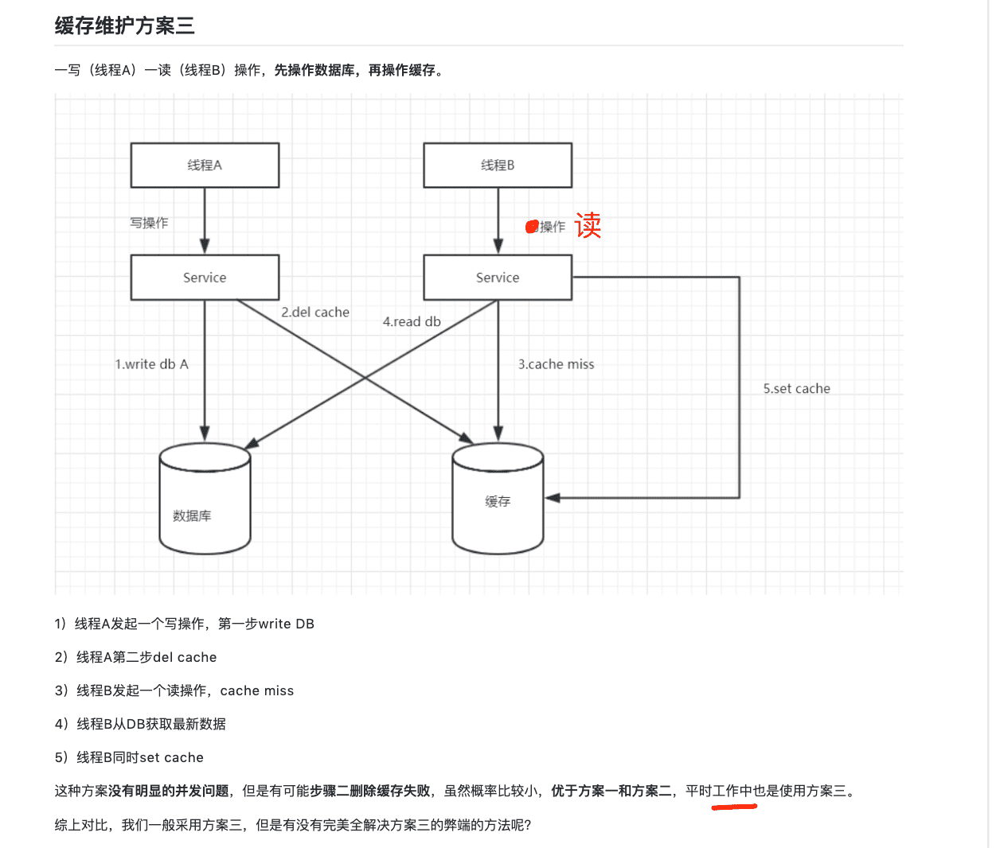
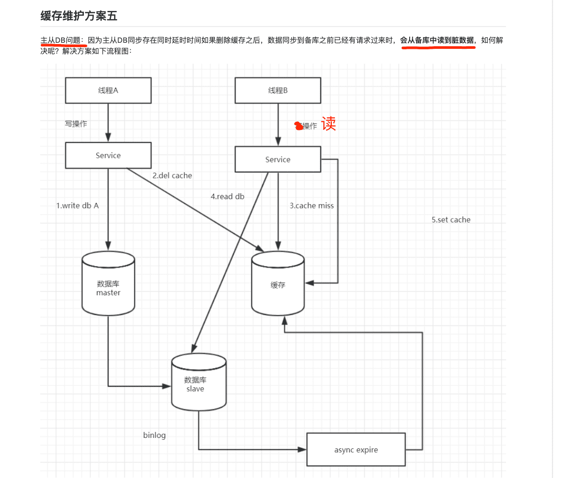

[原文链接](https://github.com/whx123/JavaHome/blob/master/%E5%B7%A5%E4%BD%9C%E6%80%BB%E7%BB%93/%E5%B9%B6%E5%8F%91%E7%8E%AF%E5%A2%83%E4%B8%8B%EF%BC%8C%E5%85%88%E6%93%8D%E4%BD%9C%E6%95%B0%E6%8D%AE%E5%BA%93%E8%BF%98%E6%98%AF%E5%85%88%E6%93%8D%E4%BD%9C%E7%BC%93%E5%AD%98%EF%BC%9F.md)

