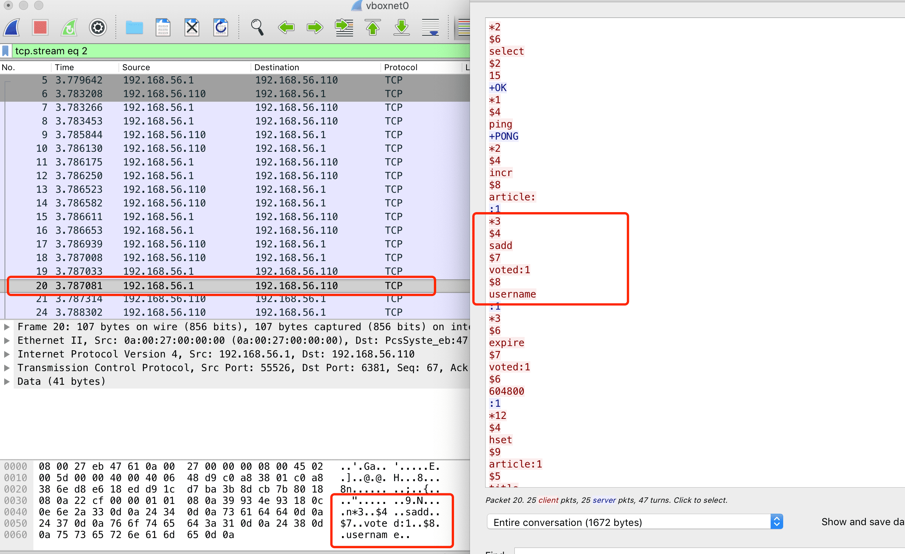

Pdf文档路径
```
/Users/hfb/Documents/1Vue后端知识/1redis/600003 Redis实战.pdf
```


项目代码路径:
``` bash
cd /Users/hfb/projects/go/mod-pro/redis-in-action/golang
```


[译书者个人站点](http://huangz.me/)

(110虚拟机下进行监听,运行go语言的测试用例)

第一章节:给文章点赞

``` bash
hfb@hfb:~/redis$ redis-cli -p 6381
127.0.0.1:6381> 
127.0.0.1:6381> 
127.0.0.1:6381> monitor  (redis 日志分析, 类似于mysql普通 genernal 日志)
OK
1615030978.766382 [0 192.168.56.1:53737] "select" "15"
1615030978.767740 [15 192.168.56.1:53737] "ping"
1615030978.769058 [15 192.168.56.1:53737] "incr" "article:"
1615030978.770385 [15 192.168.56.1:53737] "sadd" "voted:1" "username"
1615030978.773208 [15 192.168.56.1:53737] "expire" "voted:1" "604800"
1615030978.775724 [15 192.168.56.1:53737] "hset" "article:1" "time" "1615030978" "votes" "1" "title" "A title" "link" "http://www.google.com" "poster" "username"
1615030978.776890 [15 192.168.56.1:53737] "zadd" "score:" "1615031410" "article:1"
1615030978.777614 [15 192.168.56.1:53737] "zadd" "time:" "1615030978" "article:1"
1615030978.779294 [15 192.168.56.1:53737] "hgetall" "article:1"
1615030978.780286 [15 192.168.56.1:53737] "zscore" "time:" "article:1"
1615030978.780856 [15 192.168.56.1:53737] "sadd" "voted:1" "other_user"
1615030978.781699 [15 192.168.56.1:53737] "zincrby" "score:" "432" "article:1"
1615030978.782788 [15 192.168.56.1:53737] "hincrby" "article:1" "votes" "1"
1615030978.783770 [15 192.168.56.1:53737] "hget" "article:1" "votes"
1615030978.784908 [15 192.168.56.1:53737] "zrevrange" "score:" "0" "24"
1615030978.788046 [15 192.168.56.1:53737] "hgetall" "article:1"
1615030978.788789 [15 192.168.56.1:53737] "sadd" "group:new-group" "article:1"
1615030978.789835 [15 192.168.56.1:53737] "exists" "score:new-group"
1615030978.791358 [15 192.168.56.1:53737] "zinterstore" "score:new-group" "2" "group:new-group" "score:" "aggregate" "MAX"
1615030978.791929 [15 192.168.56.1:53737] "expire" "score:new-group" "60"
1615030978.792560 [15 192.168.56.1:53737] "zrevrange" "score:new-group" "0" "24"
1615030978.793404 [15 192.168.56.1:53737] "hgetall" "article:1"
1615030978.794080 [15 192.168.56.1:53737] "flushdb"
```


``` go

func Test(t *testing.T) {
	conn := redisConn.ConnectRedis()
	client := model.NewArticleRepo(conn)

	articleId := client.PostArticle("username", "A title", "http://www.google.com")
	t.Log("We posted a new article with id: ", articleId)
	assertStringResult(t, "1", articleId)

	r := client.Conn.HGetAll("article:" + articleId).Val()
	t.Log("\nIts HASH looks like: ", r)
	assertTrue(t, len(r) != 0)

	client.ArticleVote("article:"+articleId, "other_user")
	v, _ := client.Conn.HGet("article:"+articleId, "votes").Int()
	t.Log("\nWe voted for the article, it now has votes: ", v)
	assertTrue(t, v >= 1)

	t.Log("\nThe currently highest-scoring articles are: ")
	articles := client.GetArticles(1, "")
	assertTrue(t, len(articles) >= 1)
	for k, v := range articles {
		t.Log(k, v)
	}

	client.AddRemoveGroups(articleId, []string{"new-group"}, []string{})
	articles = client.GetGroupArticles("new-group", "score:", 1)
	t.Log("\nWe added the article to a new group, other articles include: ")
	assertTrue(t, len(articles) >= 1)
	for k, v := range articles {
		t.Log(k, v)
	}
	defer client.Reset()
}
```


tcp抓包,redis连接产生的数据流:




