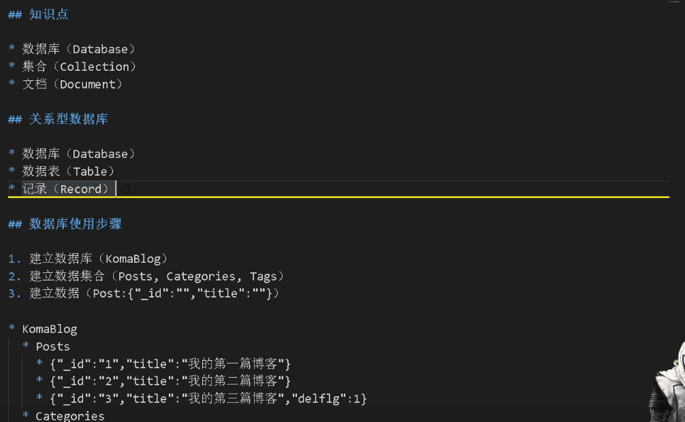

[视频学习资料](https://www.bilibili.com/video/BV1WW411N73E?from=search&seid=10306358317762669963)


[git文档的资料](https://gitee.com/komavideo/LearnMongoDB)





文档所在目录 (在Navicat Premium中进行实验验证)
``` bash
cd /Users/hfb/projects/docs/LearnMongoDB
```

