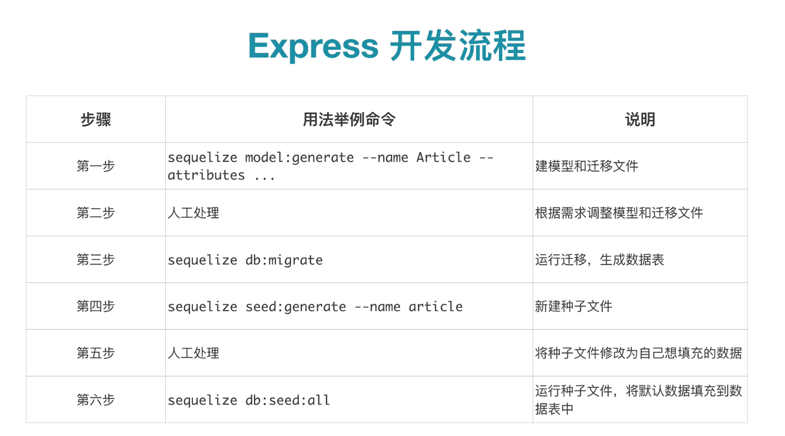

[视频教程Node.js入门 - 使用Express + Sequelize实作API](https://www.bilibili.com/video/BV1Zt411J7va?from=search&seid=7052202580299354010)


[git示例地址,官方写法与封装](https://github.com/sequelize/express-example)

项目路径:
``` bash
cd /Users/hfb/projects/js/server/express-example/express-main-example
yarn run start
```

* 示例用的sqlite
* 两个node命令很简洁:一条是准备初始的数据,一条是运行服务器


::: tip
现代前端开发，无论做什么都基本离不开 Node.js了。有了 Node.js，js 就成了一个无所不能的语言。无论你是使用 Webpack 来打包前端项目，或者来开发Api接口，还是使用 React Native 开发原生App，亦或是开发桌面软件，Node.js 都是必不可少的东西了。
:::





* js服务器端代码,全栈方案


