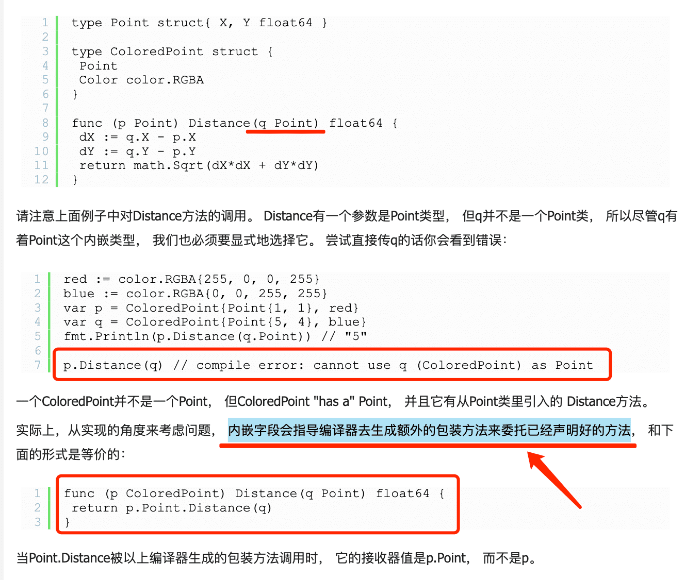

## 封装
  * 结构体中字段名的首字母是小写字母，那么这样的字段是私有的，相当于private字段。
  * 外部包裹能直接访问，如果是在名的首字母是大写字母，那么这样的字段对外暴露的 

## 组合实现继承 `匿名组合`
  * 可以利用面向接口编程原则的一系列优点，封装性行耦合性低
  * 继承的编译期确定实现，组合的运行态指定
  * 组合是非侵入式的，继承是侵入式的

## 接口实现多态
  * 接口的多种不同实现方式即为多态

[参考](https://blog.csdn.net/baolingye/article/details/111166714)

---

## 组合的原理 `匿名组合`
  * 匿名成员有隐式的名字
  * 匿名可能冲突(duplicate field)

[匿名组合](https://www.jb51.net/article/146333.htm)