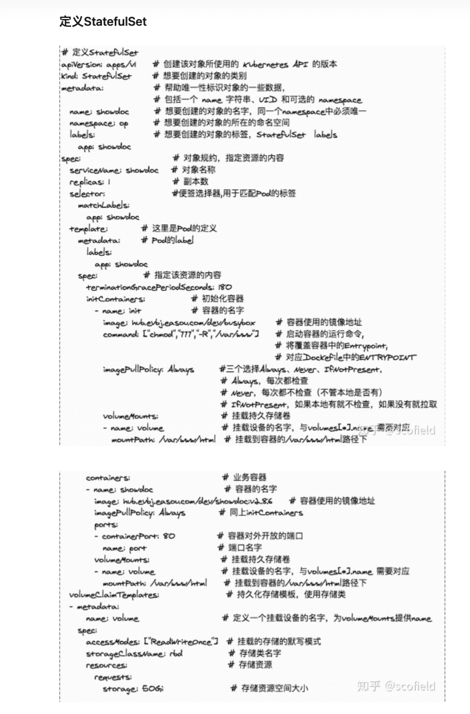

## 定义StatefulSet





``` yaml
apiVersion: apps/v1
kind: StatefulSet
metadata:
  name: mongodb
spec:
  replicas: 3
  serviceName: mongodb
  selector:
    matchLabels:
      app: mongodb
  template:
    metadata:
      labels:
        app: mongodb
    spec:
      containers:
        - name: mongo
          image: mongo:4.4
          # IfNotPresent 仅本地没有镜像时才远程拉，Always 永远都是从远程拉，Never 永远只用本地镜像，本地没有则报错
          imagePullPolicy: IfNotPresent
```
