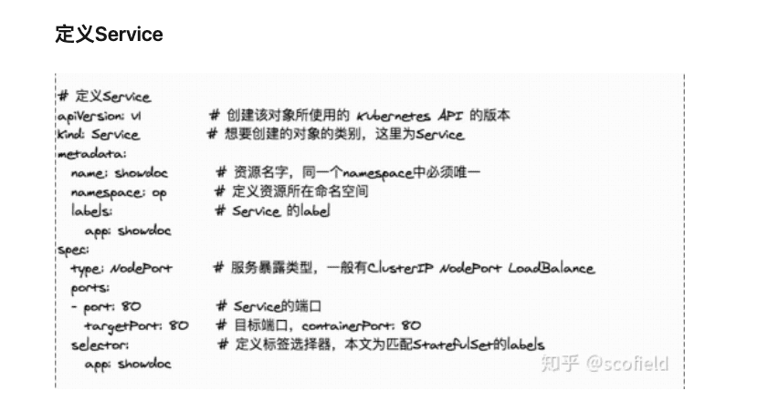

## Service实例应用

``` yaml
apiVersion: v1
kind: Service
metadata:
  name: test-k8s
spec:
  selector:
    app: test-k8s
  # 默认 ClusterIp 集群内可访问，NodePort 节点可访问，LoadBalancer 负载均衡模式（需要负载均衡器才可用）
  type: NodePort
  ports:
    - nodePort: 31001   # 节点端口，范围固定 30000 ~ 32767
      port: 8080        # 本 Service 的端口
      targetPort: 8080  # 容器端口
```


