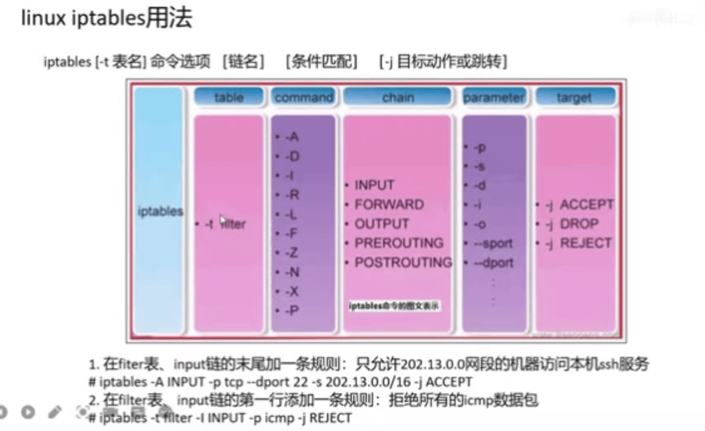

## 4表5链

## iptables 四表
  * #### filter  `过滤数据包` `实现软件防火墙`
  * #### nat : `网络地址转换` `改变源ip` `改变目的ip` `改变源端口` `改变目的端口`
  * mangle : 修改服务类型,ttl , 配置路由实现qos内核模块
  * raw : 决定数据包是否被状态跟踪机制处理

## iptables 链的匹配原则:
  #### 从序列号1的开始,直到匹配到第一条合适的规则并执行,后续规则即使能匹配也不再执行, `经常会匹配到的规则放在表前`

## iptables 五链: `代表内核5个不同的处理点` 
  #### PREROUTING : 报文进入路由前 `nat` 
         * `目的地址转换`
  #### INPUT : 报文进入路由并且目标ip为本机  `filter`
         * `包过滤`
  #### FORWARD : 报文进入路由并且目标ip非本机 `filter`
         * `包过滤`
  #### OUTPUT : 由本机产生,向外发送 `filter` `nat`
         * `包过滤`
  #### POSTROUTING : 发送到网卡前  `nat`
         * `源地址转换`

## iptables 用法
  #### iptables [-t 表名table] 命令选项command [链名]chain [条件匹配]parameter [-j 目标动作或跳转]target
    * [-t 表名table]  `-t filter` `-t nat`
    * 命令选项command 
      * `-A` 
      * `-D`
    * [链名]chain `INPUT `FORWARD` `OUTPUT` `PREROUTING` `POSTROUTING`
    * [条件匹配]parameter 
      * `-p` : 协议 `tcp` `udp` `icmp` `all` `a protocol name from /etc/protocols`
      * `-s` : 源网络地址   `network name` `hostnae` `subnet(192.168.0.0/24,192.168.0.0/255.255.255.0)`
      * `-d` : 目的网络地址 `network name` `hostnae` `subnet(192.168.0.0/24,192.168.0.0/255.255.255.0)`
      * `-i` `-o`  : 接口interfacename `eth0` `eth+`
      * `-sport` : 源端口
      * `-dport` : 目的端口

## iptables示例  `结合实战`
  #### 在filter表,input链的未尾加一条规则:  `拒绝掉192.168.1.214访问192.168.1.165的ssh服务`
    * iptables -A INPUT -p tcp --dport 22 -s 192.168.1.214/32 -j REJECT
  #### 在filter表,input链的第一行添加一条规则:  165设备上操作:拒绝掉192.168.1.214icmp数据包
    * iptables -t filter -A INPUT -p icmp -s 192.168.1.214/32 -j REJECT
  #### 把所有从本机出去的封包的源ip地址由192.168.1.0改为61.129.66.5   `实现多人共享一个公网ip上网` `模拟一个实战场景?`
    * iptables -t nat -A POSTROUTING -s 192.168.1.0/24 -j SNAT 61.129.66.5
  #### 把进入本机的所有封包目的ip地址由202.96.129.5改为192.168.1.2 `实现对内网服务的访问`
    * iptables -t nat -A PREROUTING -d 202.96.129.5 -j DNAT 192.168.1.2

## 自定义链  `165设备上操作:拒绝掉192.168.1.214icmp数据包,,放到链上`
  #### 定义(创建)自定义链  : iptables -t filter -N IN_ICMP
  #### 在input链中引用自定义链  : iptables -I INPUT -p icmp -j IN_ICMP
  #### 在自定义链配置规则 : iptables -t filter -I IN_ICMP -s 192.168.1.214/32 -j REJECT

## 基本操作
  #### 删除某条规则
    * iptables -L -n --line-number
    * iptables -D INPUT 4

hfb@ubuntu:~$ sudo iptables -L -n --line-number
Chain INPUT (policy ACCEPT)
num  target     prot opt source               destination         
1    KUBE-NODEPORTS  all  --  0.0.0.0/0            0.0.0.0/0            /* kubernetes health check service ports */
2    KUBE-EXTERNAL-SERVICES  all  --  0.0.0.0/0            0.0.0.0/0            ctstate NEW /* kubernetes externally-visible service portals */
3    KUBE-FIREWALL  all  --  0.0.0.0/0            0.0.0.0/0           
4    REJECT     tcp  --  192.168.1.214        0.0.0.0/0            tcp dpt:22 reject-with icmp-port-unreachable
5    REJECT     icmp --  192.168.1.214        0.0.0.0/0            reject-with icmp-port-unreachable

## 作业: k8s有哪些自定义链 165设备上

hfb@ubuntu:~$ sudo iptables -L -n --line-number
Chain INPUT (policy ACCEPT)
num  target     prot opt source               destination         
1    IN_ICMP    icmp --  0.0.0.0/0            0.0.0.0/0           
2    KUBE-NODEPORTS  all  --  0.0.0.0/0            0.0.0.0/0            /* kubernetes health check service ports */
3    KUBE-EXTERNAL-SERVICES  all  --  0.0.0.0/0            0.0.0.0/0            ctstate NEW /* kubernetes externally-visible service portals */
4    KUBE-FIREWALL  all  --  0.0.0.0/0            0.0.0.0/0           

Chain FORWARD (policy DROP)
num  target     prot opt source               destination         
1    KUBE-FORWARD  all  --  0.0.0.0/0            0.0.0.0/0            /* kubernetes forwarding rules */
2    KUBE-SERVICES  all  --  0.0.0.0/0            0.0.0.0/0            ctstate NEW /* kubernetes service portals */
3    KUBE-EXTERNAL-SERVICES  all  --  0.0.0.0/0            0.0.0.0/0            ctstate NEW /* kubernetes externally-visible service portals */
4    DOCKER-USER  all  --  0.0.0.0/0            0.0.0.0/0           
5    DOCKER-ISOLATION-STAGE-1  all  --  0.0.0.0/0            0.0.0.0/0           
6    ACCEPT     all  --  0.0.0.0/0            0.0.0.0/0            ctstate RELATED,ESTABLISHED
7    DOCKER     all  --  0.0.0.0/0            0.0.0.0/0           
8    ACCEPT     all  --  0.0.0.0/0            0.0.0.0/0           
9    ACCEPT     all  --  0.0.0.0/0            0.0.0.0/0           
10   ACCEPT     all  --  10.244.0.0/16        0.0.0.0/0            /* flanneld forward */
11   ACCEPT     all  --  0.0.0.0/0            10.244.0.0/16        /* flanneld forward */

[参考:第9讲](https://www.bilibili.com/video/BV1qF411e77r?p=1&share_medium=android&share_plat=android&share_session_id=79a8d06d-a14c-44d4-ac57-b898bcb49578&share_source=WEIXIN&share_tag=s_i&timestamp=1650938826&unique_k=wu5hepn)

