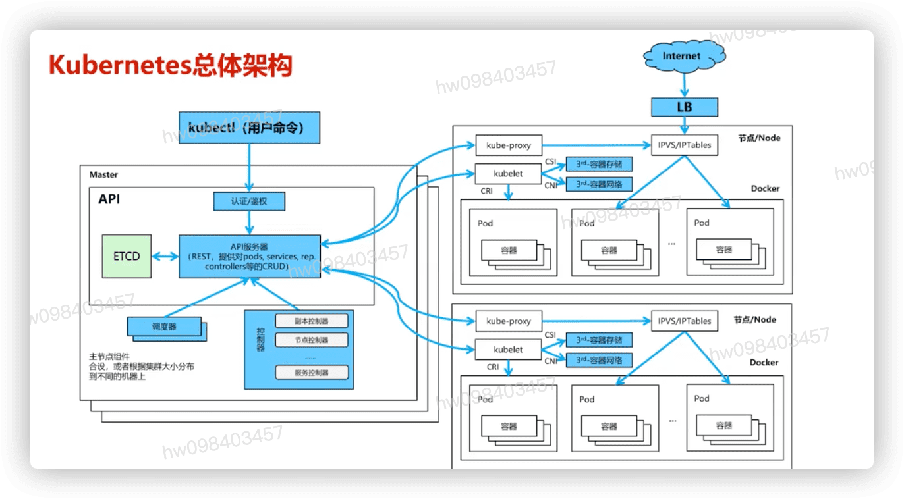
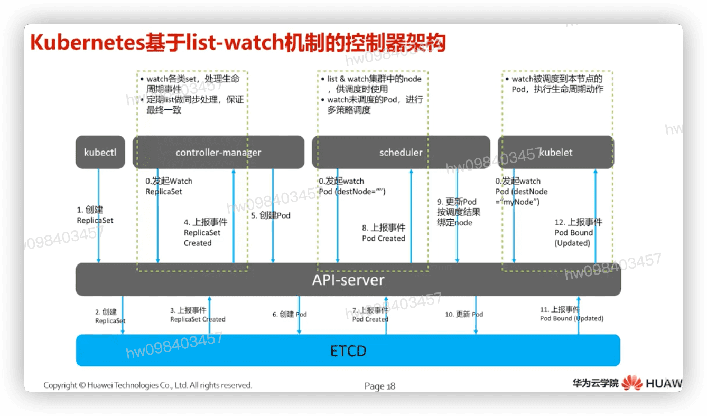
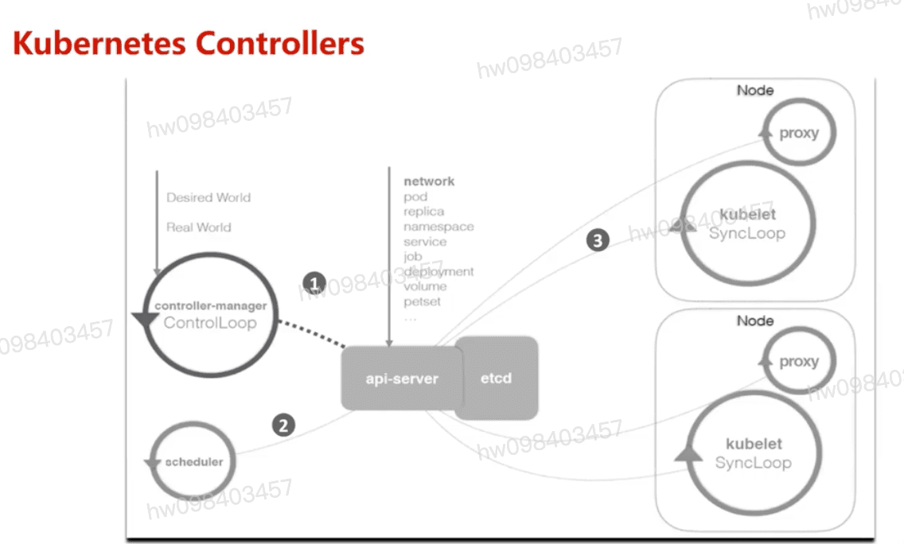
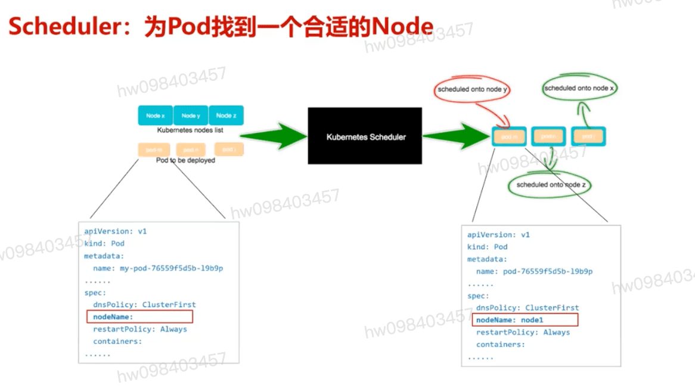
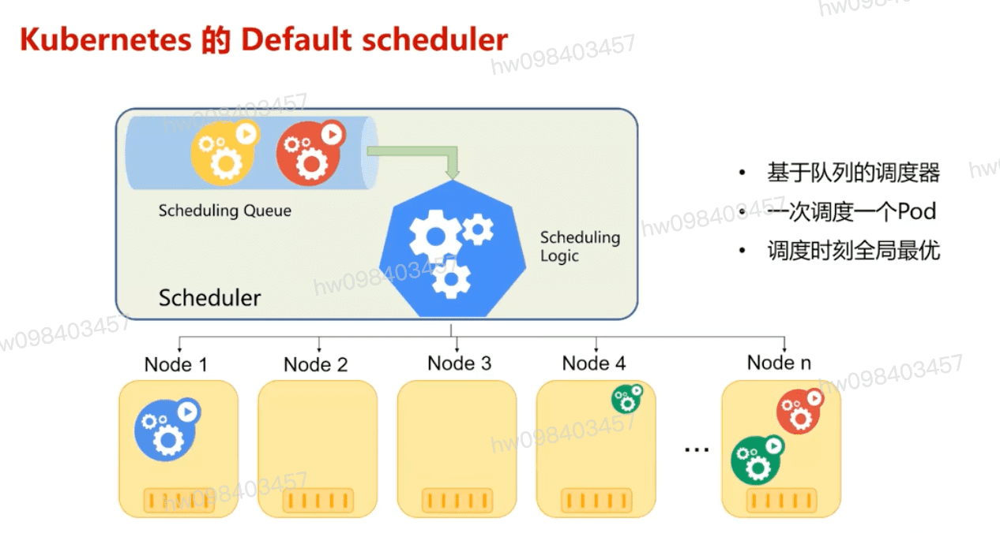

## k8s介绍
  - 发展历史
    - `随时获取` `按需使用` `随时扩展` 按使用付费

  - k8s社区架构中对各层的详细定义
    - 生态层: `ci/cd` `middleware` `log/monitor` `operators` `workflow` 
      - Ecosystem `不属于k8s范围`
    - 接口层: `kubectl` `helm` `AOS` `UI/Das hboard` `Cluster federation` `SDK(go,python...)`
      - Interface Layer Client Libraries and Tools
      - k8s官方的项目会提供库,工具,ui等外围工具
      - 外部可提供自有的实现
    - 治理层: `rbac` `cluster autoscaler` `Service catalog` `HPA` `PE`
      - Governance Layer: Automation and Policy Enforcement
      - 自动化api: 水平弹性伸缩,租户管理,集群管理
      - 策略api: 限速,资源配额,pod可靠性策略 ,network policy
    - 应用层: `dns服务实现` `Kube-proxy替代实现` `Ingress Controller` `Identity provider` `Re-scheduler` `服务发现类Controller`
      - Application Layer Deployment and Routing
      - k8s发行版必备功能和api,k8s会提供默认的实现,如scheduler
      - Controller和scheduler `可以被替换为各自的实现`,但必须通过一致性测试
      - 业管管理类Controller: daemonset/replicaset/replication/statefulset/cronjob/service/endpoint
    - 内核层: 
        #### master : `api server` `etcd` `controller mansager基础框架` `Default scheduler` `集群管理类Controller` 
        #### node : `Kubelet CRI` --> `docker` `rocket` `安全容器`
          ######  `Kubelet CNI`  --> `fiannel` `calico` `iCAN`
          ######  `Kubelet SCI/FV` --> `Fuxi` `AWS_ebs`
          ######  `Kubelet XXI...more` --> ...
      - Nucleus: API and Execution
      - 内核层是k8s最核心功能,对外提供`api`构建高层的应用,对内提供`插件式应用执行环境`
      - 提供必不可少controller,Scheduler
      - 集群管理类Controller: Node/gc/podgc/volume/namespace/resourcequota/serviceaccount
      - 相互关系
        - `内核层:提供最核心的特性最小集以及api,为必选模块`
        - `内核层之上:以各种controller插件方式实现内核api,支持可替换的实现`
        - `内核层之下:是各种适配存储,网络,容器,Cloud Provider`
  - k8s概览
    - 模型对象
      - pod
      - service
      - Deployment
      - StatefulSet
      - `增删改查`
    - 功能组件
      - `master` --->  `apiserver` `scheduler` `controller manager`
      - `node`  ---> `kubelet` `kube-proxy`

## k8s基本概念
  #### Pod 是能够创建,调度,管理的最小部署单元,是一组容器的集合,而不是单独的应用容器
         - pod里的容器共享同一个命名空间,ip地址及端口空间
         - 生命周期 `pod是短暂的而不是长久的应用`
    - pod详解 - 容器  `containers`
      - 基础容器  infrastructure`用户不可见,无需感知` `维护整个pod网络空间`
      - 初始化容器 initContainers  `先于业务容器执行`
      - 业务容器  
    - 容器基本组成
      - 镜像部分 : `镜像地址` `拉取策略`
      - 启动命令 : `comamnd:替换docker容器的` `entrypoint` `args:作为docker容器entrypoint的入参`
      - 计算资源 : `请求值:调度依据` `限制值:容器最大能使用的规格`
      - 外部输入 : `volumn` `key-value`
    - Pod与工作负载的关系   workload 1<---> pod
      - `label-selector` `ownerReference`
      - Pod通过工作负载实现应用的运维 `伸缩` `升级`  
  #### 关键工作负载 ReplicaSet
    - RepicaSet 副本控制器
    - 确保pod的一定数据的份数(replica)
    - 解决pod的扩容 缩容问题
    - 通常用于无状态应用
  #### Deployment `上线部署` `滚动升级` `暂停上线任务` `回滚到以前某一版本` `无人值守的上线,解决复杂沟通,操作风险`
    - 启动(上线/部署)一个pod或者Replicaset
    - 查检deployment是否成功
    - 更新deployment重新创建相应的pods (例如使用新的image)
    - 如果deployment不稳定,可以回滚

## k8s总体架构 `系统组件`
  #### User 
  #### Master
    - apiserver
    - etcd : 数据存储
    - controller
    - scheduler
  #### nodes

    - kubelet
    - kube-proxy `ipvs` `iptables` `ipvs称之为IP虚拟服务器（IP Virtual Server，简写为IPVS）`
    - add-ons
    - container runtime

  #### k8s基于list-watch机制的控制器架构  `保证最终一致性`

  #### k8s controller

## Scheduler : 为Pod找到适合的Node

## k8s 默认的schedule实现

## Demo简介
  #### frontend : 前台服务
         - 两个版本
  #### advertisement : 广告服务
  #### forecast : 天气预报服务
         - 天气信息的存储
  #### recommendation : 推荐服务

[参考](https://education.huaweicloud.com/courses/course-v1:HuaweiX+CBUCNXI032+Self-paced/courseware/72732567245d4ffe86a86f1b17188d2a/95eca7e7ff6c4585b22c0a4470cf8905/)

