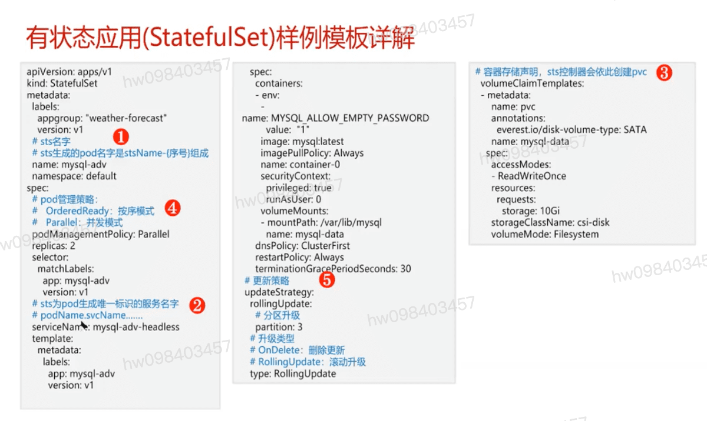
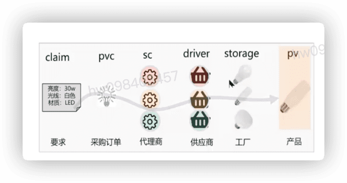
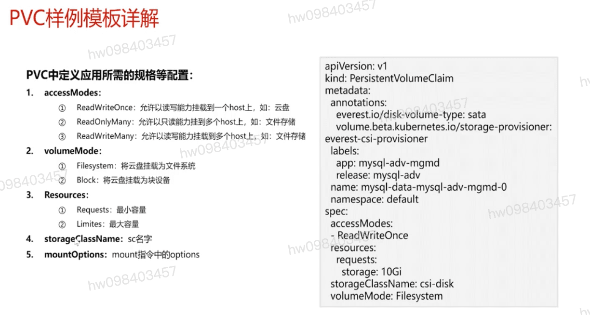
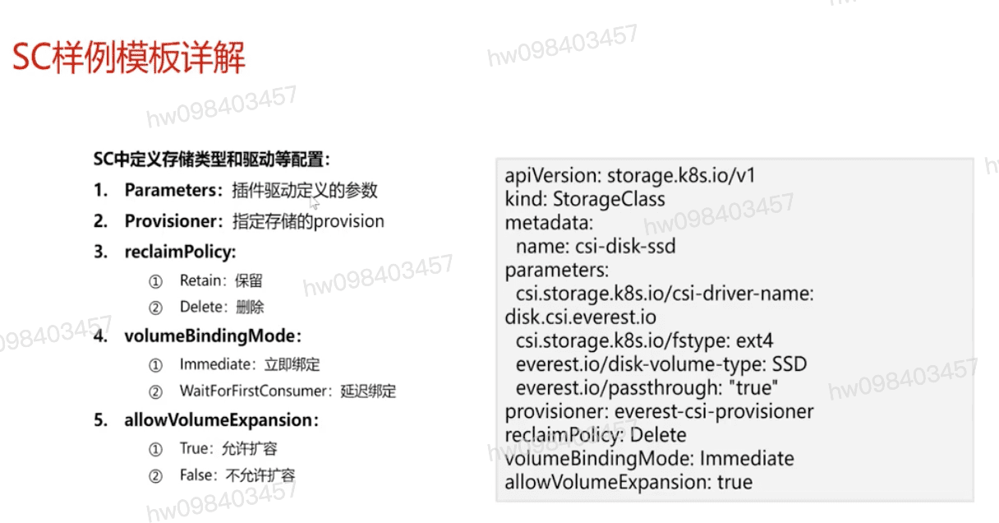
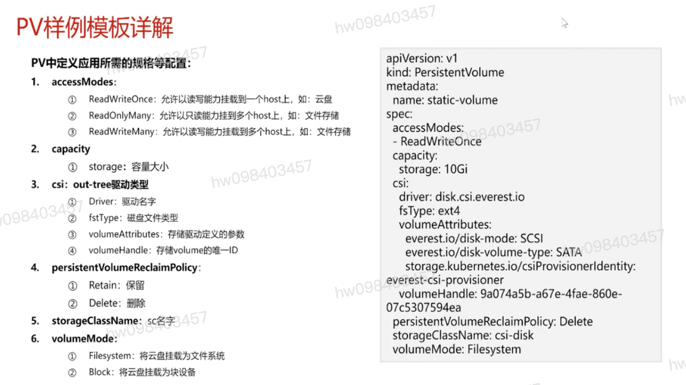

## 问题分题 有一部分应用需要将结果数据(`状态`)缓存下来,并永久的记录在存储中,以供后续使用
  - 计算维度
    - 每个pod的名字需要是稳定的,不会发生变化
    - pods之间的启动,升级,退出可以按照某种顺序控制
  - 存储维度
    - 存储是持久的,拥有独立于pod的生命周期,不会随着pod的生命周期结束而销毁
    - 每个pod与其使用的存储关系是稳定的,不会因升级等因素而发生变化
  - 网络维度
    - 每个pod有独立,稳定的网络标识

## 在状态应用概念介绍  `云硬盘（Elastic Volume Service）`
  - 稳定:
    - 稳定的podName: {stsName}-{序号{0-n}}
    - 稳定的网络标识: {podName}.{headless-svcName}.{namespace}.svc_cluster.local
    - 稳定的存储关系: {volumeClaimTemplatesName}-{podName}
  - 有序:
    - 按照编号从小到大顺序的部署: 0-n
    - 按照编号从大到小进行删除: n-0
    - 支持有序的扩缩容和升级策略
  - 唯一:
    - 每个pod拥有一个唯一的网络标识: {podName}.{headless-svcName}.{namespace}.svc_cluster.local
  - 组织结构关系
    - Deployment -> ReplicaSet -> Pod
    - StatefulSet -> Pod

## 有状态应用(StatefulSet)样例模板详解
  - sts生成的pod名字是stsName-{序号}组成
  - pod管理策略
    - OrderReady 按序模式
    - Parallel 并发模式
  - sts为pod生成唯一标识的服务名字
    - podName.svcName...
  - 容器存储声明,sts控制器会依此创建pvc

## PV/PVC/SC概念
  #### PersistentVolume: pv 持久化存储,是k8s为云原生应用提供一种拥有独立生命周期的,用户可管理的存储的抽象设计
  #### PersistentVolumeClaim: pvc 持久化存储声明,是k8s为解耦云原生应用和数据存储而设计的,通过pvc可以让资源管控更细更灵活,应用模板更通用
  #### StorageClass: sc 存储类,是k8s平台为存储提供商提供存储接入的一种声明. 通过sc和相应的存储插件(sci)为容器应用提供持久存储卷的能力

## 解读 PV/PVC/SC概念的关系
  - pvc 采购订单 
    - sc 代理商
      - driver 供应商
        - storagge 工厂
          - pv 产品

## PVC样例模板详解
  #### accessModel:
    - ReadWriteOnce : 允许以读写能力挂载到一个host上,如云盘
    - ReadOnlyMany : 允许只读能力挂到多个host上,如文件存储
    - ReadWriteMany : 允许以读写能力挂载到多个host上,如文件存储
  #### volumeMode:
    - Filesystem : 将云盘挂载为文件系统
    - Block : 将云盘挂载为块设备
  #### Resources:
    - Requests: 最小容量
    - Limites: 最大容量
  #### storageClassName: sc名字
  #### mountOptions: mount指令options

## SC样例模板详解
  #### Parameters: 插件驱动定义的参数
  #### Provisioner: 指定存储的provision
  #### reclaimPolicy:
         - Retain 保留
         - Delete 删除
  #### volumeBindingMode:
         - immediate 立即绑定
         - WaitForFirstConsumer 延迟绑定
  #### allowVolumeExpansion
         - Ture 允许扩容
         - False 不允许扩容

## pv样例模板详解
  #### accessModes:
    - ReadWriteOnce : 允许以读写能力挂载到一个host上,如云盘
    - ReadOnlyMany : 允许只读能力挂到多个host上,如文件存储
    - ReadWriteMany : 允许以读写能力挂载到多个host上,如文件存储
  #### capacity
    - storage : 容量大小
  #### csi: out-tree驱动类型
    - Driver: 驱动名字
    - fsType: 磁盘文件类型
    - volumeAttribute: 存储驱动定义的参数
    - volumeHandle: 存储唯一ID
  #### persistentVolumeReclaimPolicy:
    - Retain 保留
    - Delete 删除
  #### storageClassName: sc名字
  #### volumeMode:
    - Filesystem : 将云盘挂载为文件系统
    - Block : 将云盘挂载为块设备

##  有状态应用&持久化存储的最佳实践

## 华为云
  #### CCE静态卷
  #### CCE动态卷

