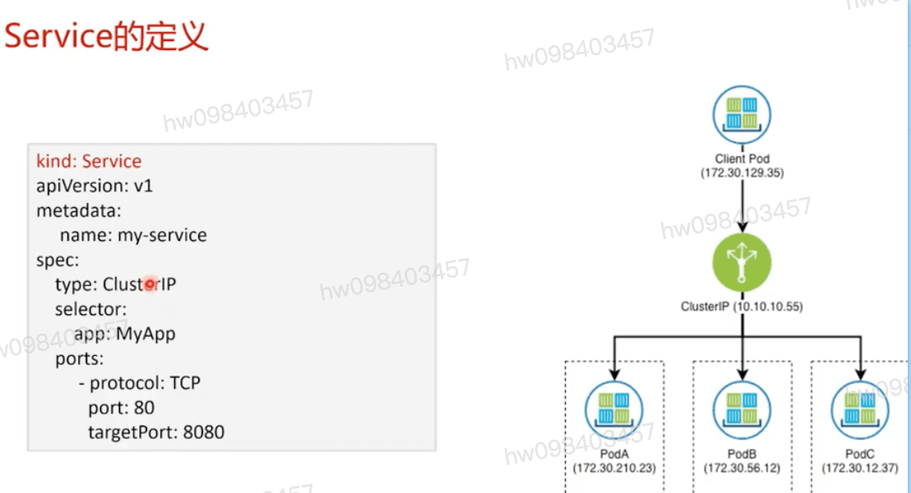
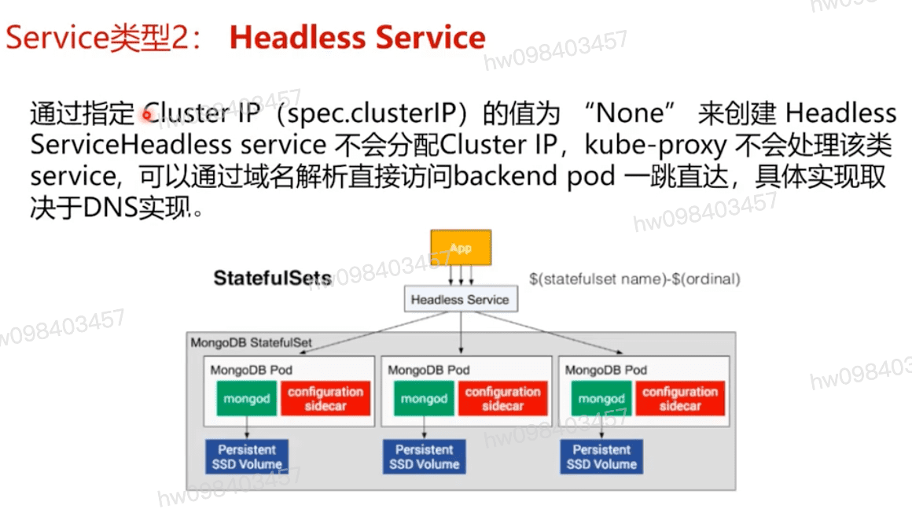
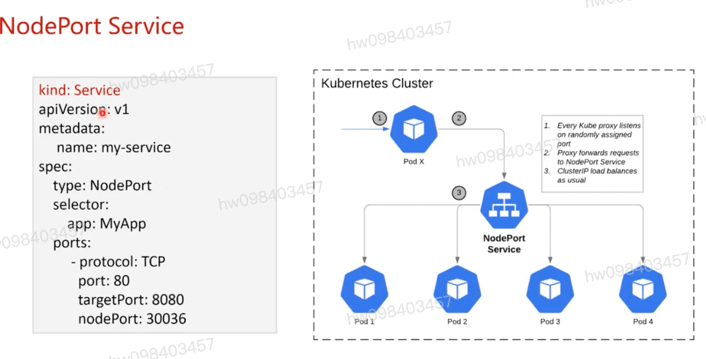
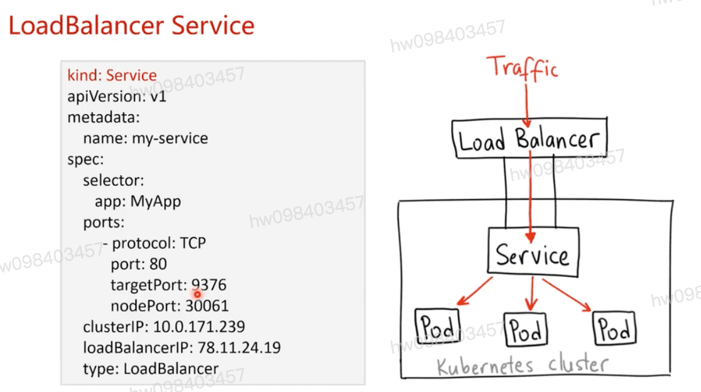
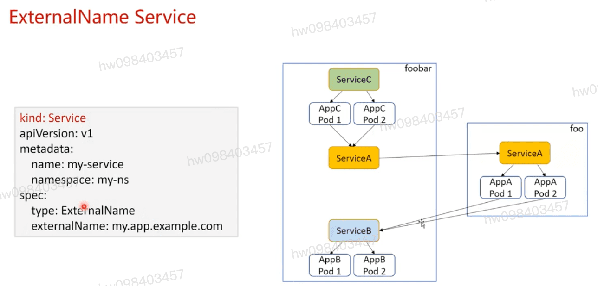
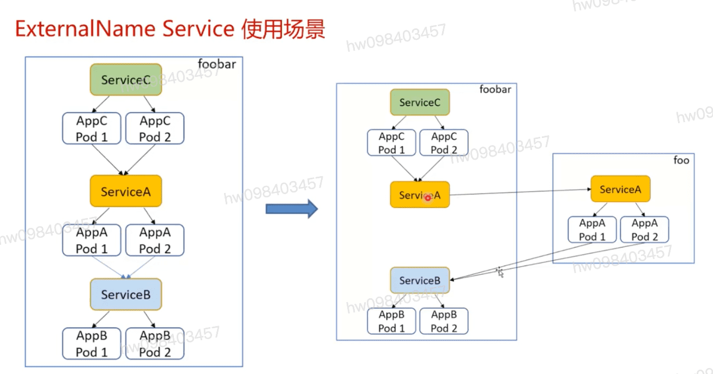
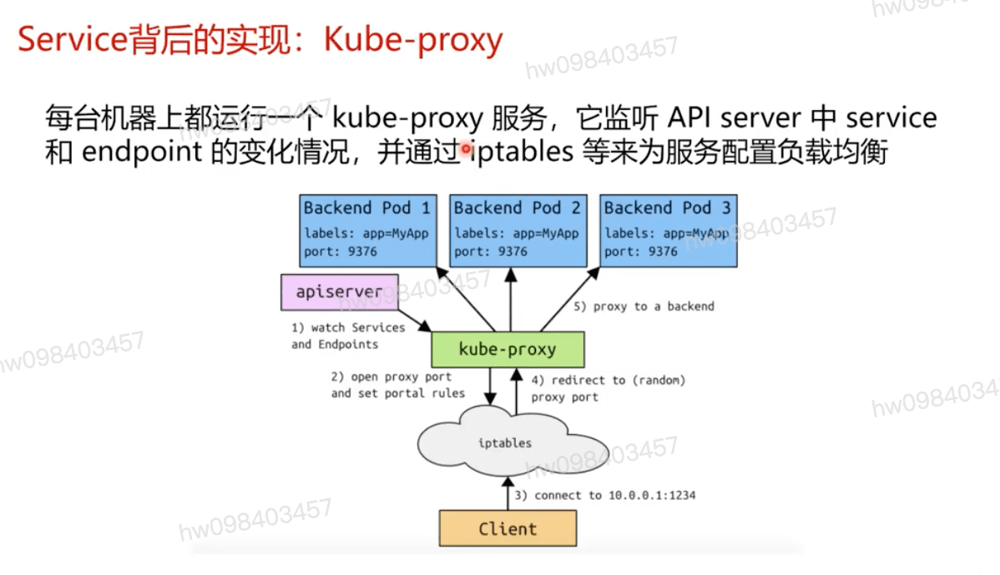
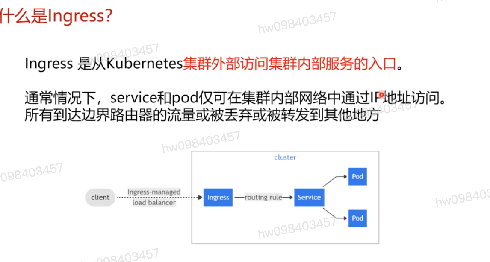
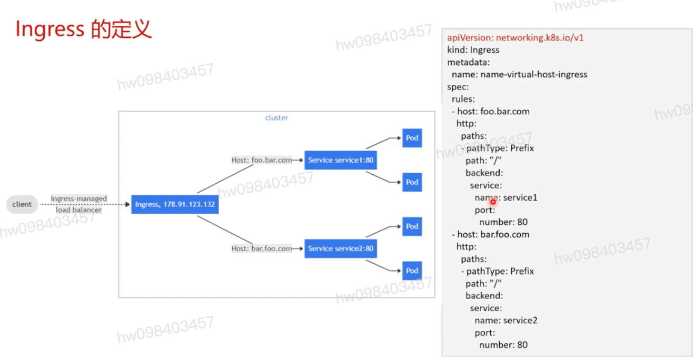
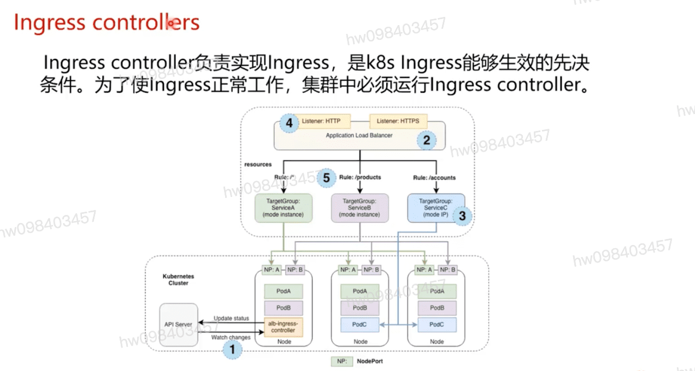

## Service基本概念
  #### k8s service定义了这样一种抽象: 一个pod的逻辑分组,一种可以访问它们的策略  通常称为微服务
    - Clusterip k8s集群内部虚拟服务ip 由kube-proxy
    - Endpoints: k8s 资源对象Service实际服务后端的集合. 手动创建或endpoints controller自动生成

## 样例及逻辑架构
  - selector : pod 后端的选择器
  - ports:
    - protocol
    - port
    - targetPort

## 

## Service类型2: Headless Service

  #### 可通过域名解析直接访问backend pod 一跳直达,具体取决于DNS实现

## 地布服务 - 服务类型
  #### ClusterIp : 通过集群的内部ip 暴露服务,服务只能够在集群内部可以访问
  #### NodePort : 通过每个Node上的IP和静态端口(NodePort)暴露服务.NodePort服务会路由到ClusterIp服务,这个ClusterIp服务会自动创建.通过请求<NodeIp>:<NodePort>,可以从集群的外部访问一个NodePort服务
  #### LoadBalancer:使用云提供商的负载均衡器,可以向外部暴露服务.外部的负载均衡器可以路由到NodePort服务和ClusterIp服务
  #### ExternalName:通过返回CNAME和它的值,可以将服务映射到externalName字段 例如 `foo.bar.example.com` 

## NodePort Service示例及逻辑结构

## LoadBalance服务示例及逻辑结构

## externalName Service

## externalName Service使用场景

## Service背后的实现: kube-proxy 转发与负载均衡

## Ingress 是从k8s `集群外部访问集群内部服务的入口` `七层`

  #### 所有到达边界路由器的流量或被丢弃或被转发现其它地方

## Ingress使用样例

## ingress controllers

  #### ingress controller负责实现ingress, 是k8s ingress能够生效的先决条件,集群中必须运行ingress controller

