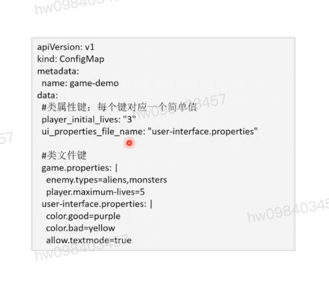

## 应用配置
  - 数据库配置
  - 证书配置
  - 应用自定义配置

## k8s应用配置
  - configMap: 一般性配置
  - Secret: 敏感信息配置

## ConfigMap概述与样例
  - 存储非敏感数据的资源对象
    - 以<key-value>形式存储配置数据
  - 设计要素
    - 解耦应用程序(镜像)和配置参数
    - 不用存储大块数据
  - 主要服务于Pod
    - 为容器提供环境变量
    - 为容器提供命令行参数
    - 为容器提供配置文件

## ConfigMap配置键值对 和 ConfigMap配置文件

## pod使用ConfigMap 配置环境变量 或 配置挂载配置文件 示例

## secret概述
  #### 是一种资源对象
    - 以<key-value>形式存储敏感数据 `密码` `token`
  #### 设计要素
    - 采用base-64编码保存
    - 通常结合RBAC rules加强安全性
  - 主要服务于Pod
    - 为容器提供环境变量
    - 为容器提供命令行参数
    - 为容器提供配置文件

[参考](https://education.huaweicloud.com/courses/course-v1:HuaweiX+CBUCNXI037+Self-paced/courseware/c88f044e418b4196a442cb26811d9c4e/b735770955e74e1482bf00e3938d70a0/)

