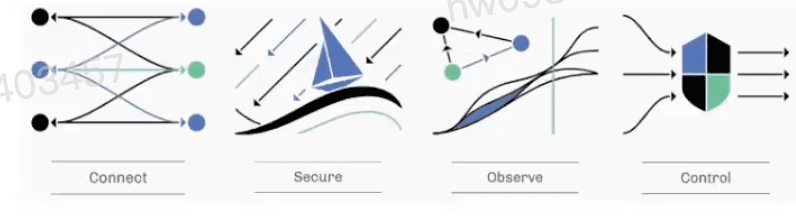
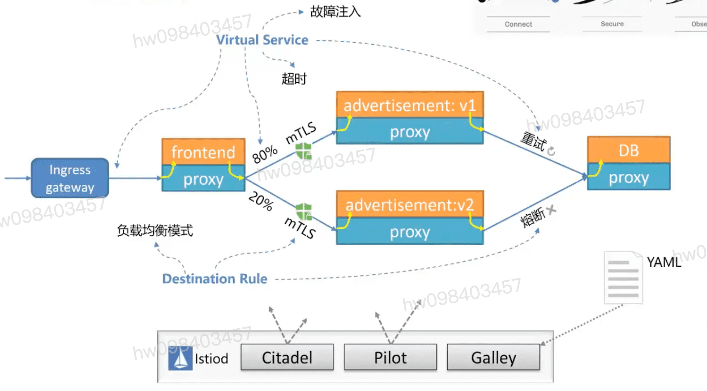
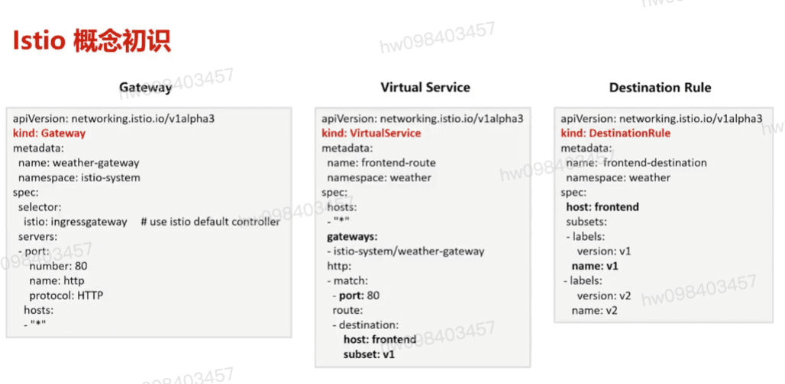
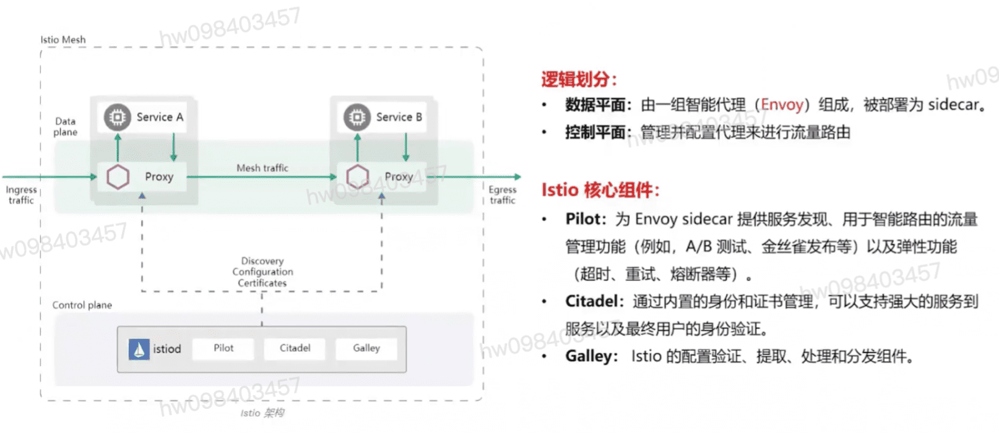

## 云原生的代表技术: 容器,服务网格,微服务,不可变基础设施 , 声明式api
  #### CNCF(Cloud Native Computing Foundation(云原生计算基金会))对云原生定义: 云原生技术有利于各组织在公有云,私有云和混合云等新型动态环境中,构建和运行可弹性扩展的应用

## Istio 服务网格
  #### 服务治理与业务逻辑逐步解耦,服务治理下沉到基础设施,服务网络以基础设施的方式提供无侵入的连接控制,安全,可监测性,灰度发布等治理能力, 如华为asm,谷歌gcp
  #### 服务网格是承载服务架构理念的云原生技术形态
  #### 服务网格是一种云原生的,应用层的网络技术
    * 云原生: 面向弹性,(微)服务化,去中心化业务场景
    * 应用层: 以应用为中心,关注应用的发布,监控,恢复等
    * 网络: 关注应用组件之间的接口,流量,数据,访问安全等

## Istio 已日趋成为服务网格标准
  #### 微服务运行在容器中日益流行
  #### k8s在容器编排领域成为事实标准
  #### Istio 提供 Service Mesh方式无侵入微服务治理能力,成为微服务治理的趋势
  #### Istio和k8s紧密结合,基于k8s构建,补齐了k8s的治理能力提供了端到端的微服务运行治理平台

## istio概念
  ####           80%    advertisement:v1  熔断
  #### frontend                                  DB
  ####           20%    advertisement:v2   重试
  #### 

## 访问信息与观测制表 Istio
  #### connect
  #### Secure
  #### Observe
  #### Control

## Istio实现机理 `ingress`

## Istio对应三种资源及示例
  * Gateway
  * Virtual Service
  * Destination Role

## Istio技术架构
  * 数据平面
  * 控制平面

## Istio 核心组件

  #### Pilot: 为envoy sidecar 提供服务发现,用于智能路由的流量管理功能(例如 A/B测试, 金丝雀发布 ) 以及弹性
  #### Citadel:内置身份和证书管理,可支持强大的服务到服务及最终用户的身份验证
  #### Galley: Istio 的配置验证,提取,处理和分发组件

## Istio 功能特性
  #### 核心理念
    * 非侵入式Sidecar注入技术 将数据面组件注入到应用所在的容器,通过劫持应用流量来进行功能实现,应用无感知
    * 北向API基于K8s CRD实现, 完全声明式,标准化
    * 数据面与控制面通过xDS gRPC标准化协议通信,支持订阅模式
  #### 核心特性
    * 服务与流量治理: 熔断,故障注入,丰富的负载均衡算法,限流,健康检查,灰度发布,蓝绿部署
    * 流量与访问可视化: 提供应用级别的监控,分布式调用链,访问日志等
    * 安全连接: 通过mTLS,认证,鉴权等安全措施帮助企业在零信任的网络中运行应用
    * 策略控制: 限流,ACL,配额,计费

## Istio应用场景
  #### 灰度发布 : 版本升级平滑过渡的一种方式
  #### 流管管理 : 负载均衡,连接池管理,熔断,故障注入
  #### 监控数据采集,运行指标分析,应用拓扑和调用链展示
  #### 应用场景: 电商应用,政企业务,视频业务

[参考](https://education.huaweicloud.com/courses/course-v1:HuaweiX+CBUCNXI037+Self-paced/courseware/c88f044e418b4196a442cb26811d9c4e/b735770955e74e1482bf00e3938d70a0/)

