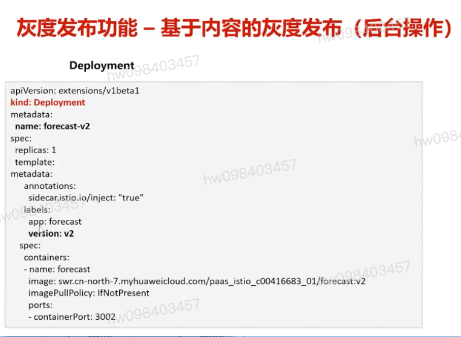

## Istio 服务网格 上课时
  #### 架构
  #### 特性  `灰度发布`
  #### 资源类型  `virtual service` `destination rule`

## 金丝雀发布(灰度发布)
  #### 基于权重
  #### 基于内容 `Cookie` `Header` `OS` `Browser`

## 蓝绿发布 `全量流量切换`

## 灰度发布流程 `前台界面的点击`
  #### 添加灰度版本
  #### 检查灰度版本正常上线
  #### 灰度规则匹配 `cookie`
  #### 观察灰度版本工作正常

## 灰度发布功能 `后台操作` `yaml`

## 本课实验: 对天气预报应用的forecast服务进行灰度发布 `ASM服务网格`
  #### 实验目标
    - 能够对灰度发布的流程有一定的认识和了解
    - 能够理解灰度发布的类型,配置简单的灰度策略
    - 能够掌握检查灰度策略是否生效的方法,包括界面和后台命令
  #### 实验前置条件:
    - k8s中启用了Istio服务网格
    - 集群上部署天气应用的四个服务v1版本,可实现服务间的访问互通
  #### 实验关键步骤
    - 观查当前的服务调用关系,服务拓扑图和应用UI
    - 对forecast服务进行基于权重/内容的灰度发布,权重/策略可任意调整,并观察服务的调用关系

