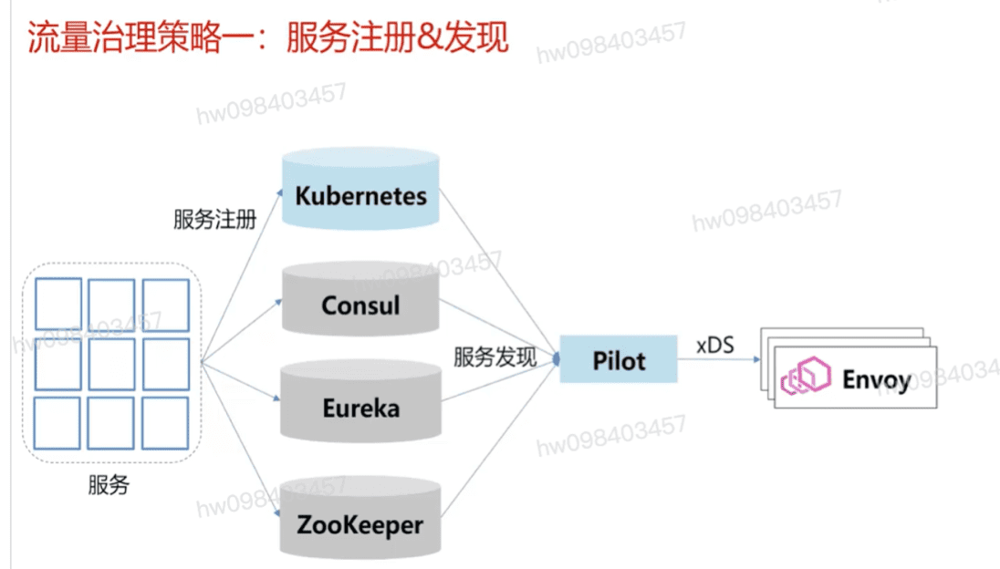
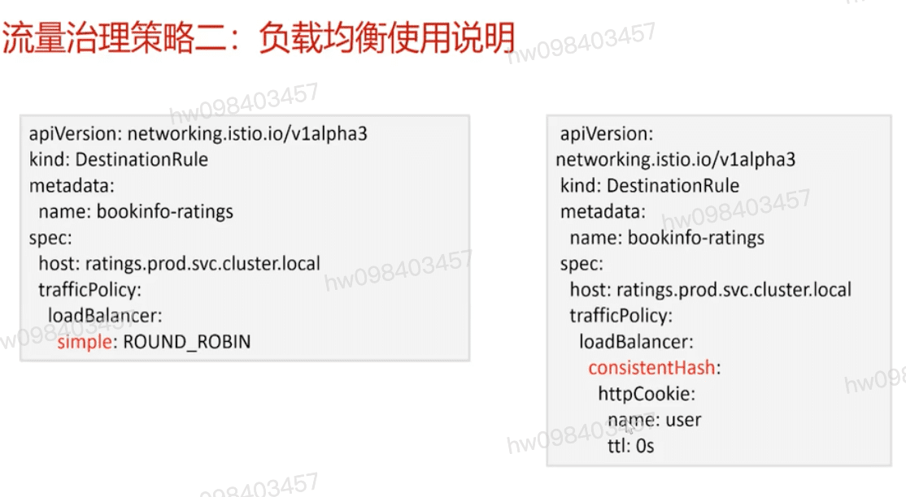
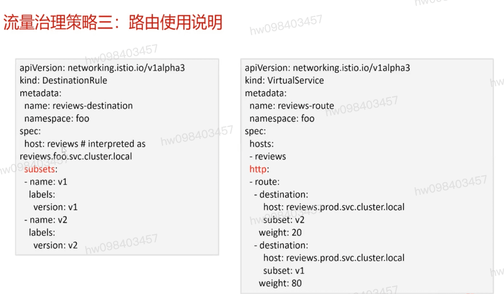
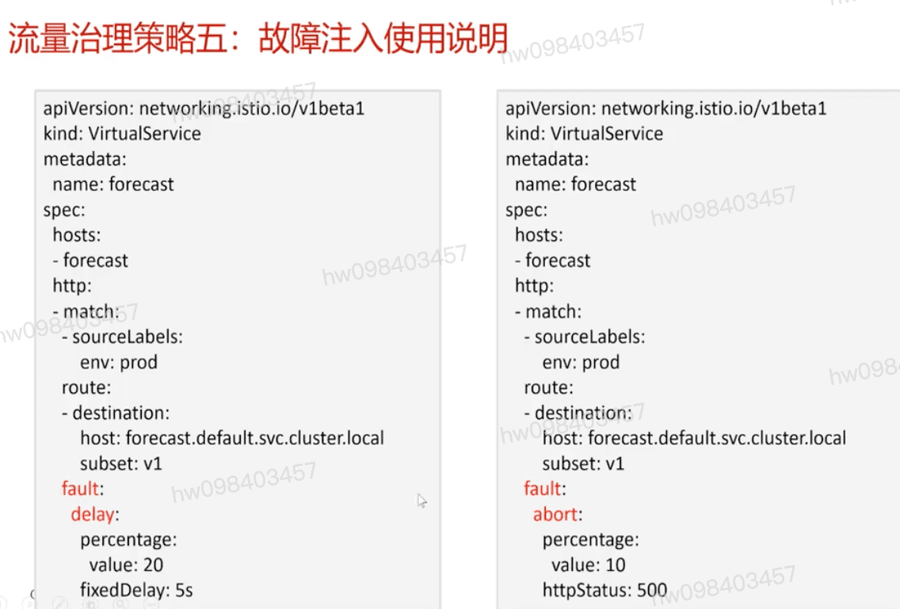
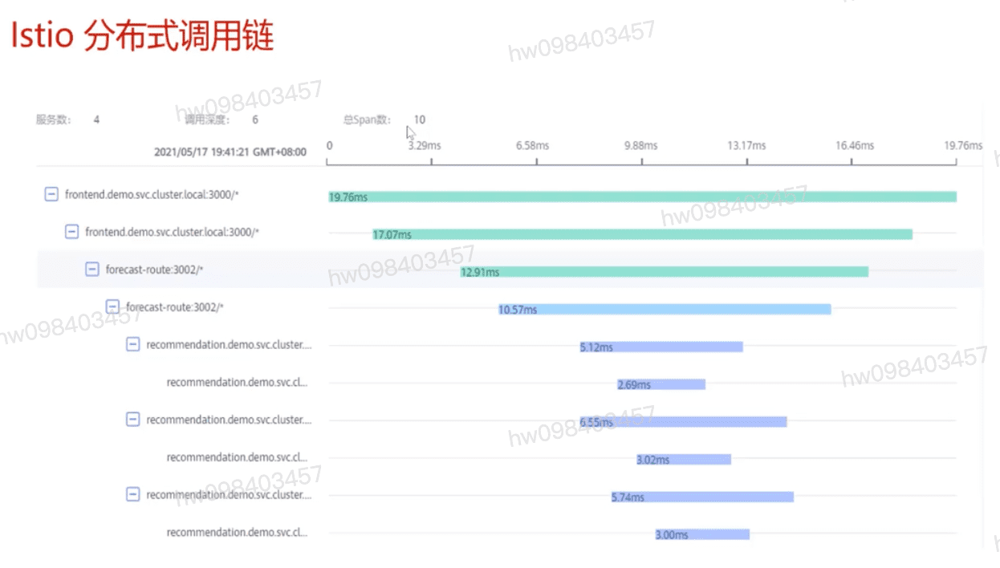
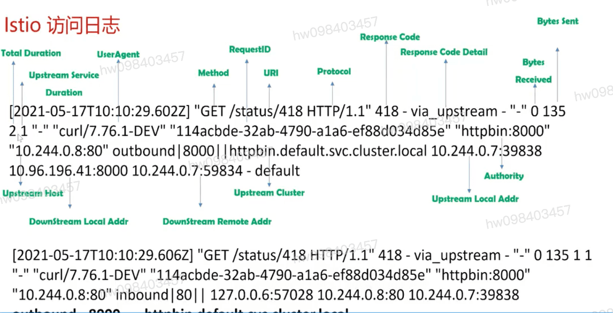

## 服务治理
  #### 服务注册和服务发现
  #### 服务负载均衡,路由,灰度,蓝绿
  #### 服务降级,熔断
  #### 服务限流
  #### 服务监控  `请求数` `请求时延` 

## 服务网格与微服务框架流量治理对比
  #### 业务侵入性     `sdk`         `sidecar`
  #### 开发语言 
  #### 灵活性       `静态配置` `更新配置重启`
  #### 升级

## 流量治理策略一:服务注册&发现

## 流量治理策略二:负载均衡
  #### 加权轮询
  #### 最少请求
  #### 环形Hash
  #### 随机
  #### 优先级负载均衡
  #### Locality 加权

## Istio负载均衡示例

## 流量治理策略三: 路由 (流量切分,灰度发布) 示例

## 流量治理策略四: 熔断,降级
  #### TCPSettings
    * maxConnects 最大连接数
    * connectTimeout 连接超时时间
    * tcpKeepAlive Keepalive设置
  #### OutlierDetection
    * 连续网关错误
    * 连续5xx错误
    * Eject分析间隔
    * 最小Eject周期
    * 最大Eject百分比
  #### HttpSettings
    * 最大并发请求
    * 每条连接最大请求数

## 流量治理五: 故障注入
  #### http请求响应延时
  #### http,grpc错误码注入

  

## 流量治理六: 限流

## 流量治理七: 失效重试

## Istio 可观测性
  #### Metrics
  #### Distributed Trace
  #### Access Logs

## Istio 分布式调用链

[参考](https://education.huaweicloud.com/courses/course-v1:HuaweiX+CBUCNXI040+Self-paced/courseware/2aac44a57121402a8ce27ab444ab8a0c/8e93556bdf724f2db81f8bab71ded967/)

