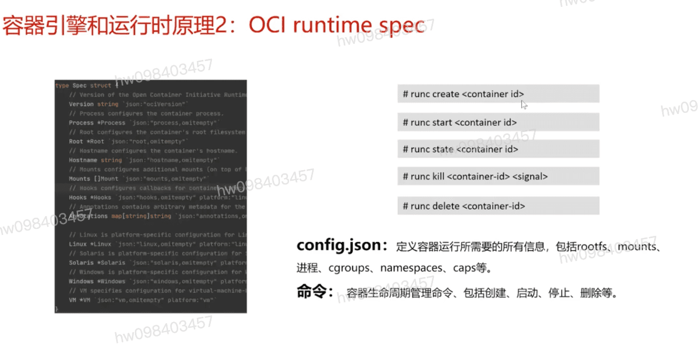

## CRI接口 
  #### 运行时  容器生命周期 `创建` `启动` `停止` `日志和性能采集`
  #### 镜像 `显示镜像` `拉取镜像` `删除镜像`

## CRI接口 概念汇总
  #### CRI接口 : `kubelet` 调用容器运行时的grpc接口
  #### dockershim : k8s对接docker api的CRI接口适配器, k8s1.21版本将其标注为废弃接口
  #### CRI-containerd: 通过containerd中的CRI插件实现了CRI接口,让containerd可直接对接containerd启动容器,无需调用docker api.当前使用最广泛的CRI接口接口实现
  #### CRI-O : 专注于在k8s运行容器的轻量级CRI接口实现(不关注开发态)

## OCI runtime spec
  #### OCI组织 : 2015 Open Container Initiative   容器运行时标准(runtime spec)  镜像标准(image spec)
  #### Runtime spec: 运行时标准,定义了容器状态和配置文件格式,容器生命周期管理命令格式和参数等
  #### runc : docker捐献给OCI社区的一个runtime spec的参考实现,docker容器也是基于runc创建的
  #### Kata-runtime: 一种基于虚拟化的安全隔离的OCI runtime spec的实现
  #### gVisor: 一种基于系统调用拦截技术的轻量级安全容器实现

## OCI 规范长这样子
  #### runc create <container id>
  #### runc start <container id>
  #### runc state <container id>
  #### runc kill <container id>
  #### runc delete <container id>
  #### config.json : 定义容器运行时所需要的所有信息,包括 `rootfs` `mounts` `进程` `cgroups` `namespaces` `caps`
  #### 命令 : `创建` `启动` `停止` `删除`

## runtime v2
  #### shimv2: 新的容器运行时接口, 基于ttrpc通信
  #### 目的: 让运行时更方便维护容器状态和生命周期,减少安全容器实现中,节点的进程数和资源调用

## 原理4: RuntimeClass
  #### RuntimeClass: k8s中的对象类型,定义了在集群中某种运行时,并且可以通过overhead和nodeSelect定制某种运行时的资源和调度行为
  #### Runtime Plugin: containerd中的runtime插件配置, `runtime名称` `二进制路径` `传递的annotation` `特权模式`
  #### runtimeClassName: pod中的字段,訪字段决定用哪种运行时启动容器

[参考](https://education.huaweicloud.com/courses/course-v1:HuaweiX+CBUCNXI041+Self-paced/courseware/05122317ec3348c88cb9744d6ea03787/62271da1daff466fb251940c5b9593c9/)

