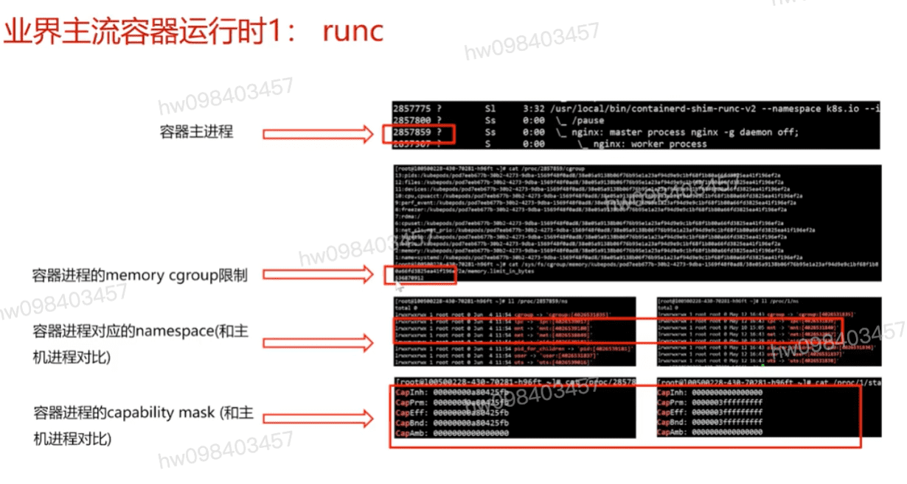

## runc
  #### Namespace: 资源和信息的可见性隔离
  #### Cgroups: 资源使用量的隔离, `cpu` `内存` `io带宽` `大页` `fd数` 
  #### Capability: 权限限制 `SYS_ADMIN` `MKNOD` `SYS_RESOURCE` `SYS_MODULES`

## runc 查看/proc限制

## kata containers

[参考](https://education.huaweicloud.com/courses/course-v1:HuaweiX+CBUCNXI041+Self-paced/courseware/05122317ec3348c88cb9744d6ea03787/62271da1daff466fb251940c5b9593c9/)

