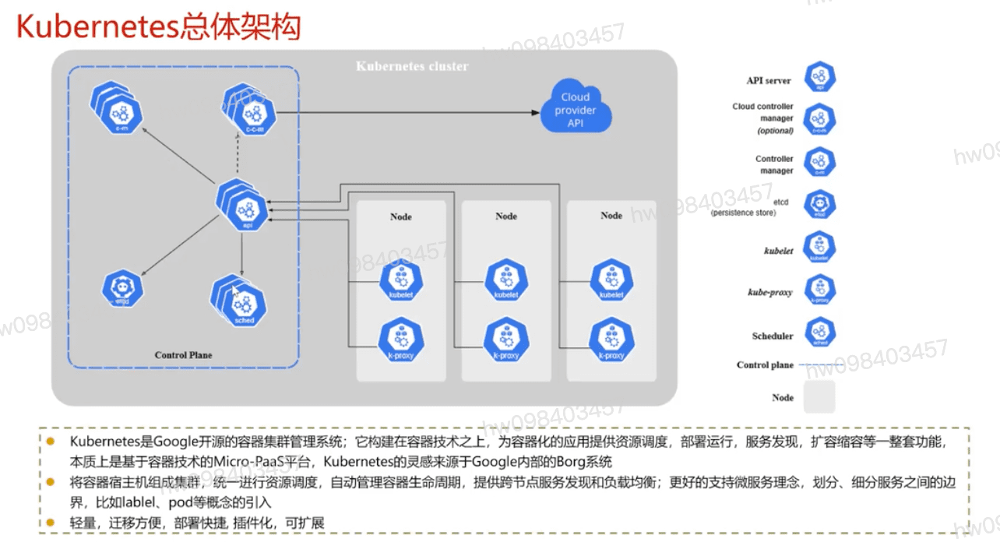

## k8s总体架构
  #### k8s是google开源的容器集群管理系统;它构建在容器技术之上,为容器化的应用提供资源调度,部署运行,服务发现,扩容缩容等一整套功能,本质上是基于容器技术的Micro-PaaS平台,k8s的灵感来源于Google内部的Borg系统
  #### 将容器宿主机组成集群,统一进行资源调度,自动管理容器生命周期,提供跨节点服务发现和负载均衡;更好的支持微服务理念,划分,细分服务之间的边界,比如label,pod等概念的引入
  #### 轻量,迁移方便,部署快捷,插件化,可扩展

## k8s核心组件 `控制面` `节点` `插件`

## 控制面
  #### Etcd: 是兼具一致性和高可用性的键值数据库,可作为保存k8s所有集群数据的后台数据库, etcd支持watch,这样组件很容易得到系统状态的变化,从而快速响应和协调工作
  #### kube-apiserver: 主要提供k8s api,提供对pods,services,replicationcontroller等对象的crud处理rest操作,验证它们,在etcd中更新相应的对象api不仅仅是面向最终用户的,同时也是面向工具和扩展开发者的,是开放生态系统的基础
  #### kube-scheduler: 通过访问k8s中binding api,scheduler负责pods在各个节点上的分配. Scheduler是插件式的,k8s将来可以支持用户自定义的scheduler
  #### kube-controller-manager: 控制器循环监听集群中资源状态,按照预期状态对资源进行管理.每个控制器就是将对应的资源牵引到期望的状态. k8s将来可以把这些控制器拆分并提供可插拔的组件
  #### cloud-controller-manager: 云控制器管理器是指嵌入特定云的控制逻辑的控制平面组件.云控制器管理器允许您链接聚合到云提供商的应用编程接口中,并分离出相互作用的组件与您的集群交互的组件.

## 节点
  #### kubelet: kubelet管理pods和它们的容器,镜像,卷等
  #### kube-proxy: 是一个简单的网络代理和负载均衡器.它具体实现service模型,每个service都会在所有的kube-proxy节点上体现. 根据service的selector所覆盖的pods,对这些pods做负载均衡来服务于service的访问者
  #### 容器运行时(Container Runtime): 容器运行环境是负责运行容器的软件. k8s支持多个容器运行环境:docker,containerd,cri-o以及任何实现k8s cri(容器运行环境接口)

## 插件(Addons)
  #### DNS : 集群DNS服务器,和环境中的其它dns服务器一起工作,它为k8s服务提供dns记录.k8s启动的容器自动将此dns服务器包含在其dns搜索列表中.

## `k8s api server` `etcd` `controller manager`  

[参考](https://education.huaweicloud.com/courses/course-v1:HuaweiX+CBUCNXI042+Self-paced/courseware/6817c598390d4a008e5c6f45777aa10b/ceeb63d76fd14b3b8448d0ad54e4369c/)

1.1 Kubernetes系统架构详解
1.2 controller控制器原理详解

1.3 list-watch机制原理详解

1.4 课程内容

1.5 随堂测试

Kubernetes系统架构详解

