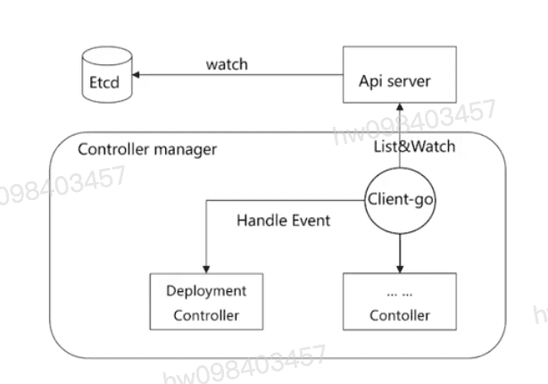
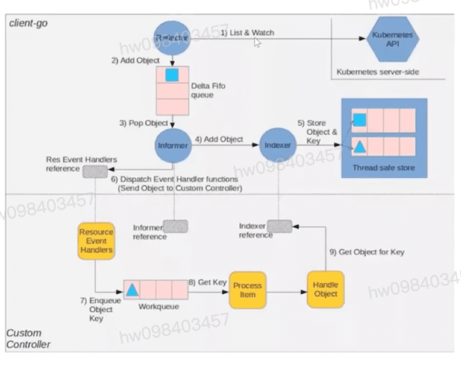

## 简介
  #### 是集群内部的管理控制中心,负责统一管理与运行不同的 Controller,实现对集群的Node,Pod等所有资源的管理.比如通过Deployment创建的某个pod发生异常退出时,RS Controller便会接受并处理该退出事件,并创建新的pod来维持预期副本数.
  #### k8s内部几乎每种特写资源都有特定Controller维护管理,而Controller Manager的职责便是把所有的Controller聚合起来:
    * 1,提供基础设施降低controller的实现复杂度
    * 2,启动和维持controller的正常运行,watch api-server,然后对不同的controller分发事件通知

  #### k8s有几十种controller,这里列举一些相对重要的Controller:
    * 1,部署控制器(Deployment Controller): 负责pod的滚动更新,回滚以及支持副本的水平扩容等.
    * 2,节点控制器(Node Controller): 负责在节点出现故障时进行通知和响应
    * 3,副本控制器(Replication Controller): 负责为系统中的每个副本控制器对象维护正确数量的pod
    * 4,端点控制器(Endpoints Controller): 填充端点(Endpoints)对象(即加入Service与pod)
    * 5,服务帐户与令牌控制器(Service Account & Token Controllers): 为新的命名空间创建默认帐户和api访问令牌
    * 6,.....

## Controller 工作流程
  #### Controller Manager主要提供了一个分发事件的能力,而不同的Controller只需要注册对应的Handle来等待接收和处理事件. 在Controller Manager的帮助下,Controller的逻辑可以做的非常纯粹,只要实现相应的EventHandler即可.以Deployment controller为例
  #### List & Watch:
    * 1,Controller manager与api-server的通信主要通过两种方式: List和Watch.
    * 2,List是短连接实现,用于获取该资源的所有object
    * 3,Watch是长连接实现,用于监听List中获取的资源的变换.
    * 4,api-server检测到资源产生变更时,会主动通知到controller manager(利用分块传输编码)
  #### client-go:
    * 1,client-go实现统一管理每种controller的list和watch
    * 2,将收到的event事件放到缓存中,异步分发给每个controller的注册的eventHandler.
    * 提问?
      * controller自己的eventHandle如何注册?
      * controller的eventHandler注册上了,client-go如何监听api-server并分发event事件的?

## 代码Controller的eventHandler如何注册?
  #### pkg/controller/deployment/depolyment_controller.go NewDeploymentController方法中,便包括了Event Handler的注册
    * AddEventHandler被封装成ProcessListener并添加到数组中,并且调用了ProcessListener的run方法.

## client-go under the hood : k8s在github上提供了一张client-go的架构图,从中可以看出,Controller正是下半部分(CustomController)描述的内容,而client-go主要完成的是上半部分

## client-go组件:
  #### Reflector: reflector用来watch特定的k8s API资源. 具体的实现是通过ListAndWatch的方法watch可以是k8s内建的资源或者是自定义的资源.当reflector通过watch API接收到有关新资源实例存在的通知时,它使用相应的列表api获取新创建的对象,并将其放入watchHandler函数内的DeltaFifo队列中.
  #### Informer: informer 从Delta Fifo队列中弹出对象,执行此操作的功能是processLoop,base controller的作用是保存对象以供以后检索
  #### Indexer: 索引器提供对象的索引功能.典型的索引用例是基于对象标签创建索引.Indexer可以根据多个索引函数维护索引.Indexer使用线程安全的数据存储对象及其键.

## 自定义controller组件:
  #### Informer reference: 指的是Informer实例的引用,定义如何使用自定义资源对象,自定义控制器代码需要创建对应的informer.
  #### Indexer reference: 

1.1 Kubernetes系统架构详解

1.2 controller控制器原理详解

1.3 list-watch机制原理详解
1.4 课程内容

1.5 随堂测试

list-watch机制原理详解

[参考](https://education.huaweicloud.com/courses/course-v1:HuaweiX+CBUCNXI042+Self-paced/courseware/6817c598390d4a008e5c6f45777aa10b/332e7af7482a4c8b92781cbece60da2a/)

