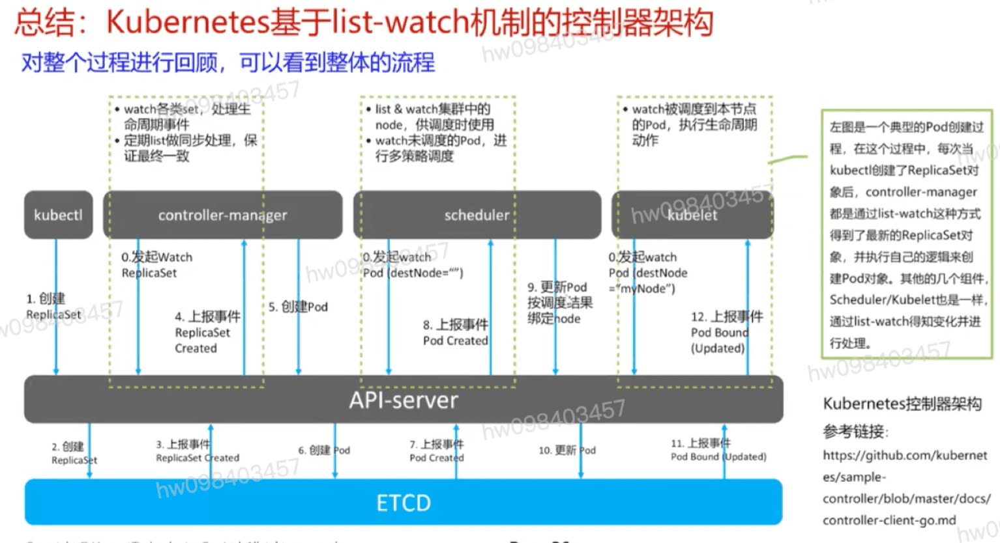

## Informer封装list-watch
  #### list-watch是k8s统一消息处理机制,各组件间协同都采用该机制进行通信.List-watch机制保证了消息的实时性,可靠性,顺序性,性能等等,为了声明式风格API奠定了良好的基础,它是优雅的通信方式,是k8s架构的精髓.对系统的性能,数据一致性起到关键性的作用.

## list-watch操作主要完成以下几个事情:
  #### 1,watch核心数据存储是etcd,是典型的发布-订阅模式.但不直接访问etcd,通过apiserver发起请求,在组件启动时进行订阅
  #### 2.可以带条件向apiserver发起watch请求....etcd发起的watch是没有条件的=>过滤必须在apiserver
  #### 3,list是watch失败,数据太陈旧后的弥补手段. list本身是一个简单的列表操作.

## 一个异步消息的系统时,对消息机制有至少如下四点要求
  #### 消息可靠性 list API获取全量数据,watch api获取增量数据
  #### 消息实时性 变更事件,推送给客户端
  #### 消息顺序性 resourceVersion的标签,这个标签是递增的数字
  #### 高性能 list-watch还具有高性能的特点,虽然仅通过周期性调用list API也能达到最终一致性的效果,但周期性频繁的轮询大大的增大了开销,增加apiserver的压力.而watch作为异步消息通知机制,复用一条长链接,保证实时性的同时也保证了性能

## 总结: k8s基于list-watch机制的控制器架构
  #### 以Pod创建过程为例

[参考](https://education.huaweicloud.com/courses/course-v1:HuaweiX+CBUCNXI042+Self-paced/courseware/6817c598390d4a008e5c6f45777aa10b/332e7af7482a4c8b92781cbece60da2a/)

