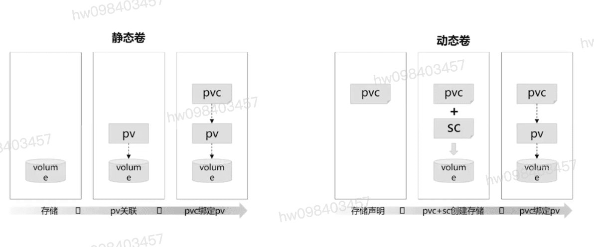
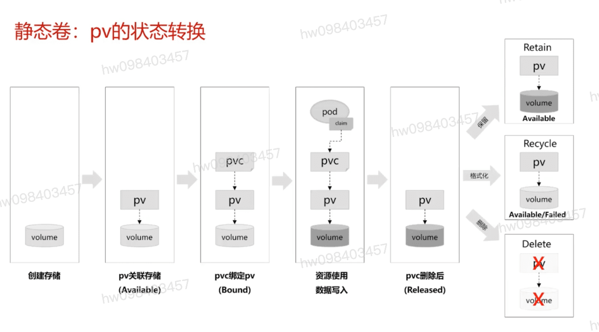
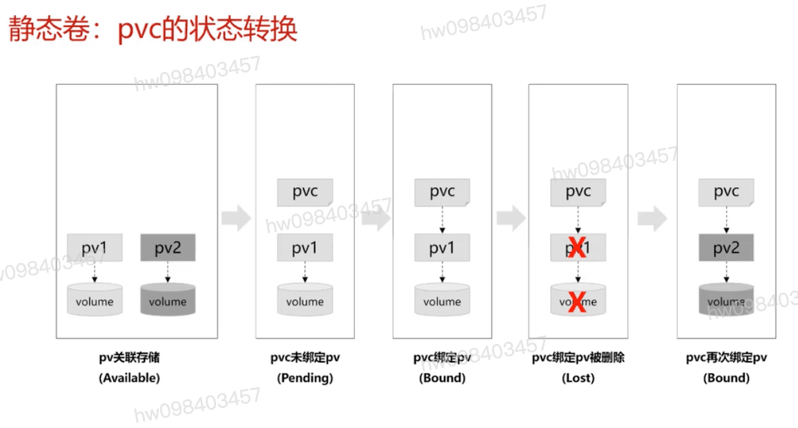
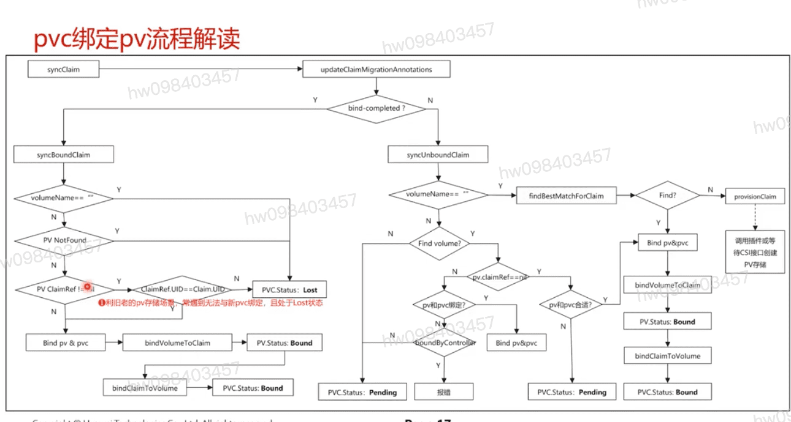

## 静态卷 动态卷

## 静态卷 pv 的状态

## 静态卷 pvc 的状态

## pvv刷选pv的流程(findBestMatchForClaim)
  #### 1, 通过size刷选恰当的pv
  #### 2, 通过volumeMode刷选一致的pv;
  #### 3, 通过Label刷选合适的pv
  #### 4, 通过sc刷选符合的pv
  #### 5, 通过AccessMode刷选符合条件的pv
  #### 6, 返回并绑定符合pvc条件,且size最小的pv

## 代码数据流

[参考](https://education.huaweicloud.com/courses/course-v1:HuaweiX+CBUCNXI044+Self-paced/courseware/bbd9280142c04709be5775cf1d93bd28/69489b0d752e42f0bf1f409fa1e2d9ad/)

