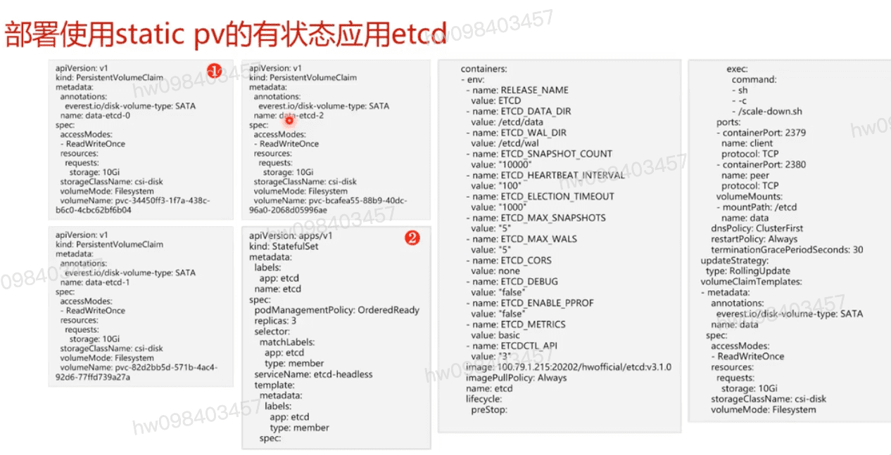

## 静态卷 Everest架构 在kube-system命名空间下  

## Everest管理面: Everest-csi-controller
  #### 1, csi-external-provisioner : 负责云存储卷的创建
  #### 2, csi-external-resizer: 负责云存储卷的扩容
  #### 3, csi-external-attacher: 负责云盘的挂卷/卸卷
  #### 4, csi-external-snapshotter

## Everest数据面: Everest-csi-driver (agent)
  #### Evs-csi-driver : 负责云盘格式化,并挂给pod使用
  #### Sfs-csi-driver : 负责将文件存储卷挂给pod使用
  #### Sfsturbo-csi-driver: 负责将极速文件系统挂给pod使用
  #### Obs-csi-driver : 负责将对象存储的并行文件系统准备好,并给pod使用

## 组织结构图,在k8s系统下 Everest架构所在位置

## 云原生应用使用存储的推荐方案 `静态卷`
  #### 文件存储 
    * 1, 使用方式: 符合标准文件协议,用户可以将文件系统挂载给服务器,像使用本地文件目录一样
    * 2, 共享方式: 数据共享,支持多台服务器共享,多台服务器可挂载相同的文件系统,数据可以共享操作和访问
    * 3, 场景对比: 企业办公OA,AI训练,门户网站,渲染,容器微服务
    * 4, 场景说明: 同时为多个pod提供共享存储服务
  #### 块存储
    * 1, 使用方式: 像使用传统服务器硬盘一样,用户可以对挂载到服务器上的块存储(硬盘)做格式化,创建文件系统等操作
    * 2, 共享方式: 数据不共享,或特殊的数台服务器共享卷
    * 3, 场景对比: 关系数据库,NoSQL数据库,ELK分布式日志搜索,企业办公应用,数据仓库,高性能计算
    * 4, 场景说明: 非共享存储,通过pv/pvc使用云盘时,一个云盘只能同时被一个pod挂载. 推荐使用有状态应用(StatefulSet) 挂载使用云盘.无状态应用(Deployment)挂载云盘的Replica需要为1.不能保证挂载,卸载的优先顺序
  #### 对象存储
    * 1, 使用方式: 具备标准Restful API 接口,用户必须通过编程或第三方工具访问对象存储
    * 2, 共享方式: 数据共享,设备无限制
    * 3, 场景对比: OTT视频 视频监控 备份/归档 大数据/IOT
    * 4, 场景说明: 不擅长于写文件的应用场景

## etcd 使用静态卷的样例

## 课程最后推荐了一个学习的链接

[参考](https://education.huaweicloud.com/courses/course-v1:HuaweiX+CBUCNXI044+Self-paced/courseware/bbd9280142c04709be5775cf1d93bd28/4b7ba3adba514b38bd2c31009d9d733e/)

