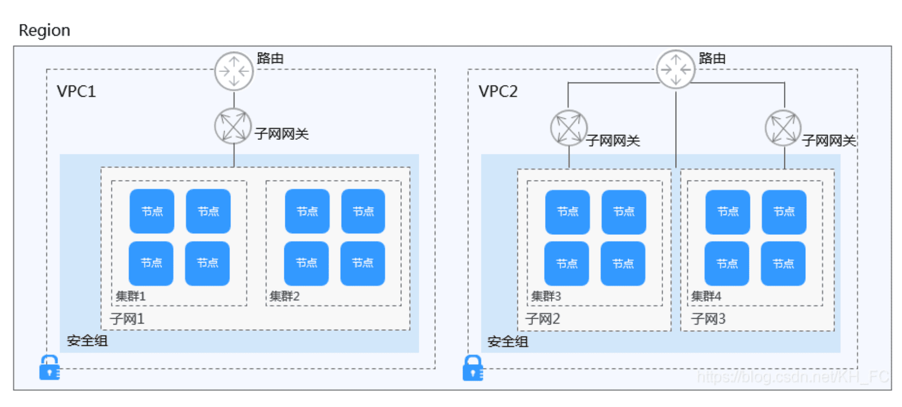

## cce : Cloud Container Engine: 云容器引擎

**云容器引擎（Cloud [Container](https://so.csdn.net/so/search?q=Container&spm=1001.2101.3001.7020) Engine，简称CCE）**
提供高度可扩展的、高性能的企业级Kubernetes集群，支持运行Docker容器。借助云容器引擎，您可以在华为云上轻松部署、管理和扩展容器化应用程序。

云容器引擎提供[Kubernetes](https://so.csdn.net/so/search?q=Kubernetes&spm=1001.2101.3001.7020)原生API，支持使用kubectl，且提供图形化控制台，让您能够拥有完整的端到端使用体验，使用云容器引擎前，建议您先了解相关的基本概念。

**集群（Cluster）**
集群指容器运行所需要的云资源组合，关联了若干[云服务](https://so.csdn.net/so/search?q=云服务&spm=1001.2101.3001.7020)器节点、负载均衡等云资源。您可以理解为集群是“同一个子网中一个或多个弹性云服务器（又称：节点）”通过相关技术组合而成的计算机群体，为容器运行提供了计算资源池。

**节点（Node）**
每一个节点对应一台服务器（可以是虚拟机实例或者物理服务器），容器应用运行在节点上。节点上运行着Agent代理程序（kubelet），用于管理节点上运行的容器实例。集群中的节点数量可以伸缩。

**节点池（NodePool）**
节点池是集群中具有相同配置的一组节点，一个节点池包含一个节点或多个节点。

**虚拟私有云（VPC）**
虚拟私有云是通过逻辑方式进行网络隔离，提供安全、隔离的网络环境。您可以在VPC中定义与传统网络无差别的虚拟网络，同时提供弹性IP、安全组等高级网络服务。

## 集群、VPC、安全组和节点的关系

**工作负载**
工作负载即Kubernetes对一组Pod的抽象模型，用于描述业务的运行载体，包括Deployment、Statefulset、Daemonset、Job、CronJob等多种类型。

- **无状态工作负载**：即kubernetes中的“Deployment”，无状态工作负载支持弹性伸缩与滚动升级，适用于实例完全独立、功能相同的场景，如：nginx、wordpress等。
- **有状态工作负载**：即kubernetes中的“StatefulSet”，有状态工作负载支持实例有序部署和删除，支持持久化存储，适用于实例间存在互访的场景，如ETCD、mysql-HA等。
- **创建守护进程集**：即kubernetes中的“DaemonSet”，守护进程集确保全部（或者某些）节点都运行一个Pod实例，支持实例动态添加到新节点，适用于实例在每个节点上都需要运行的场景，如ceph、fluentd、Prometheus
  Node Exporter等。
- **普通任务**：即kubernetes中的“Job”，普通任务是一次性运行的短任务，部署完成后即可执行。使用场景为在创建工作负载前，执行普通任务，将镜像上传至镜像仓库。
- **定时任务**：即kubernetes中的“CronJob”，定时任务是按照指定时间周期运行的短任务。使用场景为在某个固定时间点，为所有运行中的节点做时间同步。

[参考](https://blog.csdn.net/KH_FC/article/details/111373386)

