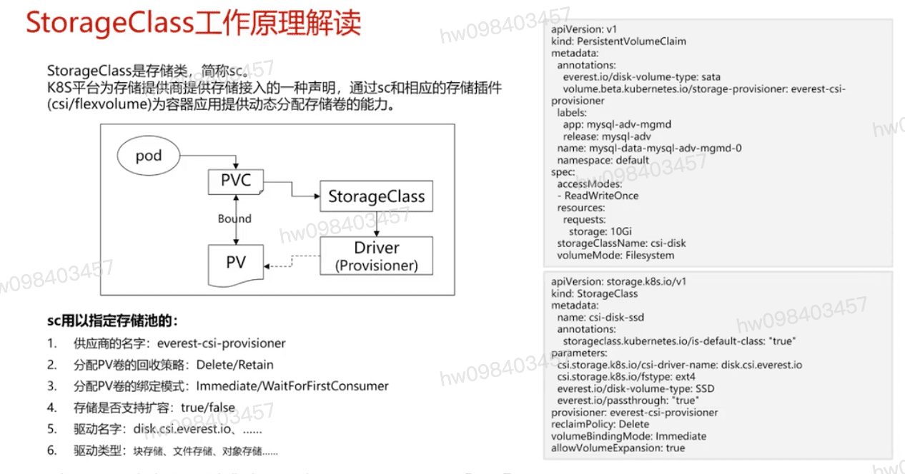
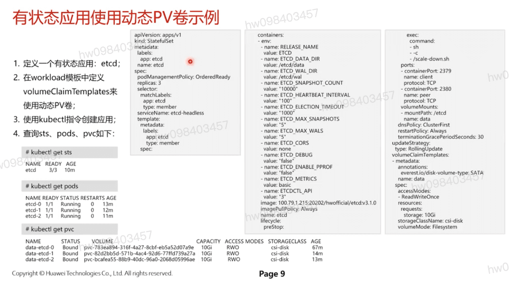

## 历史
  - k8s初期为存放分离所做的解耦设计Volume,**采用强耦合,灵活性差**的in-tree模式
  - 为支持更多应用场景,提供了一种脱离pod生命周期的,用户可管理的存储抽象设计低耦合,灵活性更强的Pv/pvc

## SC工作原理解读
  - 供应商的名字: everst-csi-provisioner
  - 分配pv卷的回收策略: Delete/Retain
  - 分配pv卷的绑定模式: Immediate/WaitForFirstConsumer
  - 存储是否支持扩容: true/false
  - 驱动名字: disk.csi.everest.io. ....
  - 驱动的类型: 块设备,文件存储,对象存储

## pv/pvc 示例

## 有状态应用使用动态pv卷示例

[参考](https://education.huaweicloud.com/courses/course-v1:HuaweiX+CBUCNXI045+Self-paced/courseware/8fab4799ab6c445b8f8dbbc0e41a95d8/10fe80b615754b24b30ec855201efd16/)

