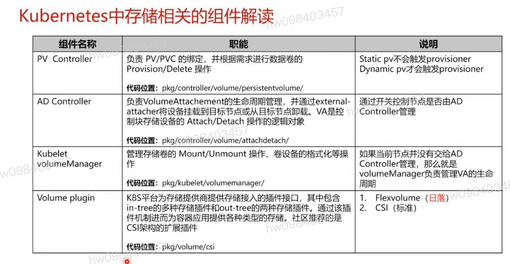
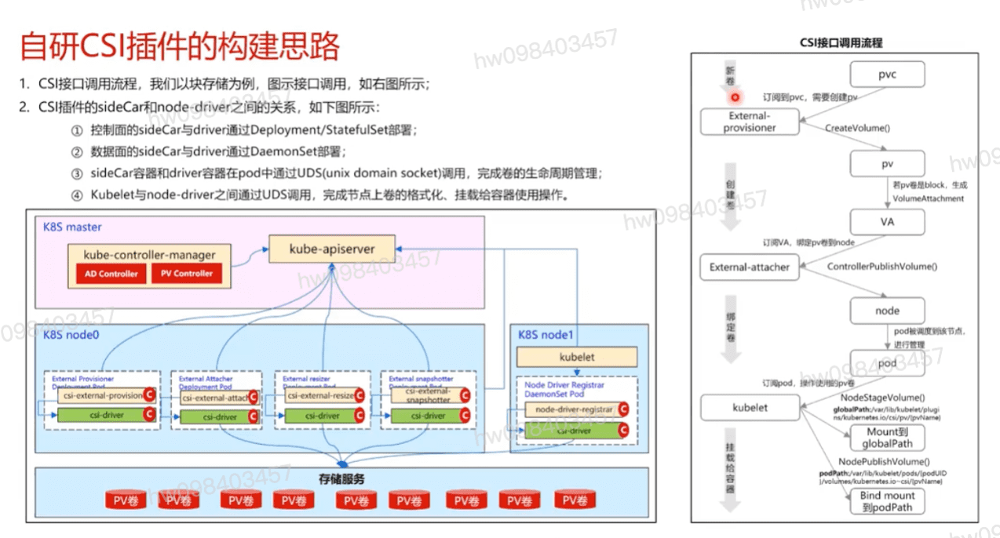
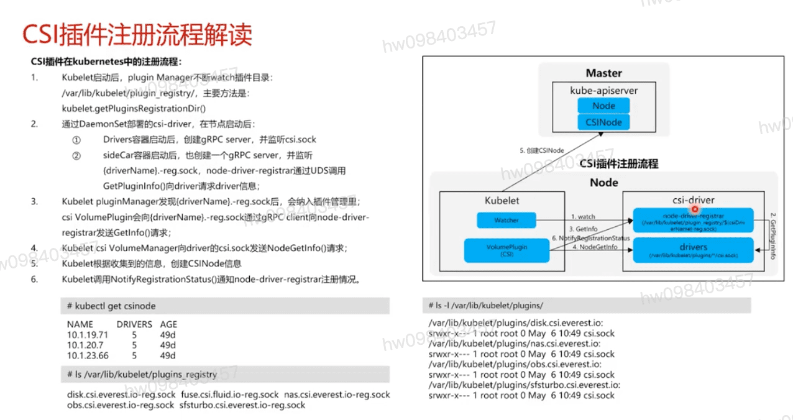

## k8s 中存储相关的组件解读,,包括指出了代码位置

## 什么是云原生存储
  - 云原生的理解
    - 技术视角: 不断演进中的设计思想,主要是为了充分利用云计算的优势,促进云计算技术发展而构建和运行应用的设计思想
    - 用户视角: 从**迭代慢,运维重,升级难**  ==>> **聚焦业务开展**
  - 云原生应用的理解: 基于云原生技术构建,运行的应用程序,它具有:
    - 行为可预测,快速弹性扩缩容
    - 持续交付,使研发流程更敏捷
    - 基于API构建,团队协作更顺畅
    - 独立性强,促进DevOps的开展
    - 依赖少,轻量,故障恢复快速
  - 云原生存储的理解:
    - 从技术视角看: 符合以应用为中心,可被声明和组合实现,是API驱动和服务自治.具有敏捷等特性的存储系统;
    - 从用户视角看: 最大化使能云原生应用特性的存储系统
  - 以CSI存储架构为例,解读容器存储架构
    - 控制接口A:
    - 控制接口B: k8s平台通过sideCar
    - 数据接口C: 数据面,存储通过文件系统,块设备等方式为k8s平台中运行的workload提供存储读写等能力

## 自研CSI插件的构建思路

## CSI插件注册流程 及简单演示查看命令
  - kubectl get csinode
  - ls -l /var/lib/kubelet/plugins/

[参考](https://education.huaweicloud.com/courses/course-v1:HuaweiX+CBUCNXI045+Self-paced/courseware/8fab4799ab6c445b8f8dbbc0e41a95d8/10fe80b615754b24b30ec855201efd16/)

