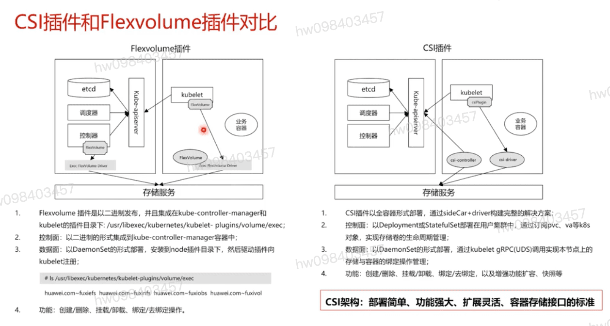
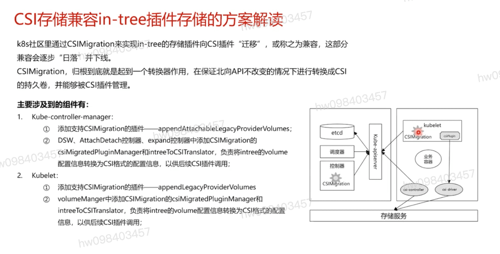
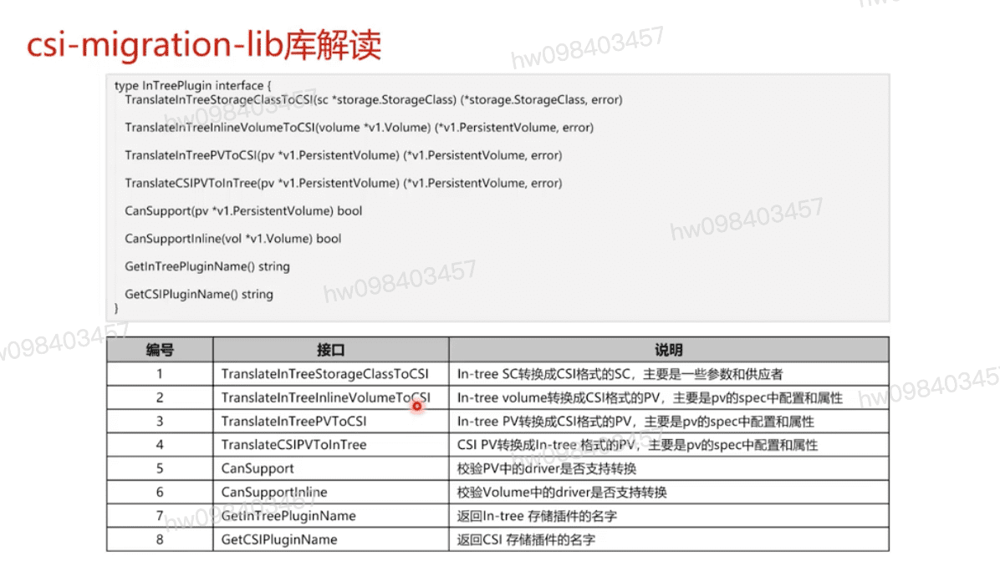

## CSI插件和Flexvolume插件对比

## 结构兼容 in-tree插件存储

## go csi-migration-lib 库解读

[参考](https://education.huaweicloud.com/courses/course-v1:HuaweiX+CBUCNXI045+Self-paced/courseware/8fab4799ab6c445b8f8dbbc0e41a95d8/9742355d114b4189ac733f644dedc5f7/)

