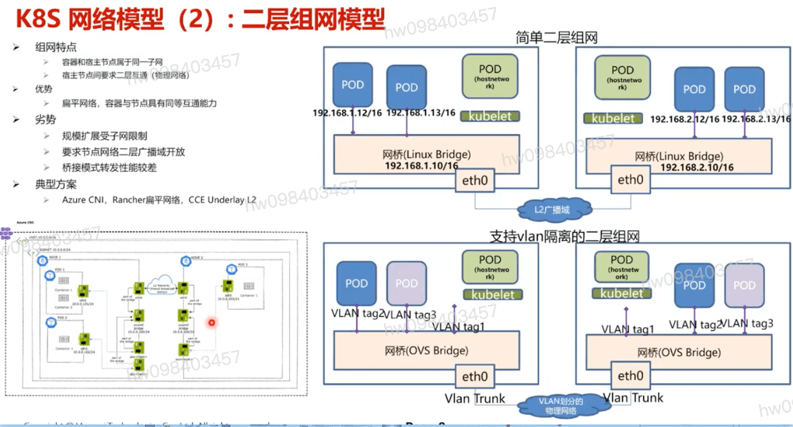

## 基本概念 厘清和前导
  - 二层桥接 vs 三层路由
  - Underlay vs Overlay
  - 物理网络 vs 虚拟网络
  - 传统网络 vs SDN网络
  - Docker网络 vs K8S网络
    - CNM vs CNI
    - 类似于 network=none

## k8s 网络模型对互通性的要求
  - pods on a node can communicate with all pods on all nodes without NAT
    - 节点上的容器pod可以与集群内任意节点上的容器pod无需NAT实现互访
  - agents on a node (e.g. system daemons,kubelet) can communicate with all pods on that node
    - 节点上的代理agent (比如:系统后台进程,kubelet) 可以与同节点上的容器pod互访
  - Note: For those platforms that support Pods running in the host network(e.g. Linux)
    - iyto

## (1) overlay组网模型
  - 同节点POD二,三层直接互通
  - 跨节点POD互通过隧道(vxlan/ipip)
  - pod访问宿主节点地址或集群外地址需要SNAT
  #### 优势
    - 底层网络解耦,节点ip互通即可
  #### 劣势
    - 隧道封装解封开销大,小包带宽损耗可达30%
    - 互通性能差
  #### 典型实现
    - flannel/VXLAN,Calico/IPIP,CCE隧道网络

## (2) 二层组网模型

## (3) 三层组网模型 

[参考](https://education.huaweicloud.com/courses/course-v1:HuaweiX+CBUCNXI046+Self-paced/courseware/af81a9458abd4a9389ea7f4279d800eb/df536bd76eea484d9f33ac28e8ba41b4/)

