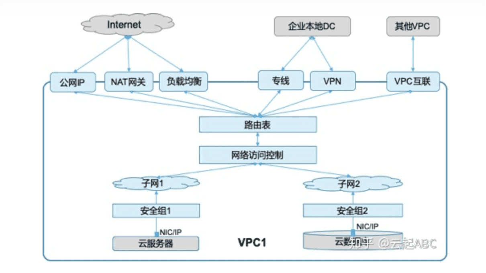
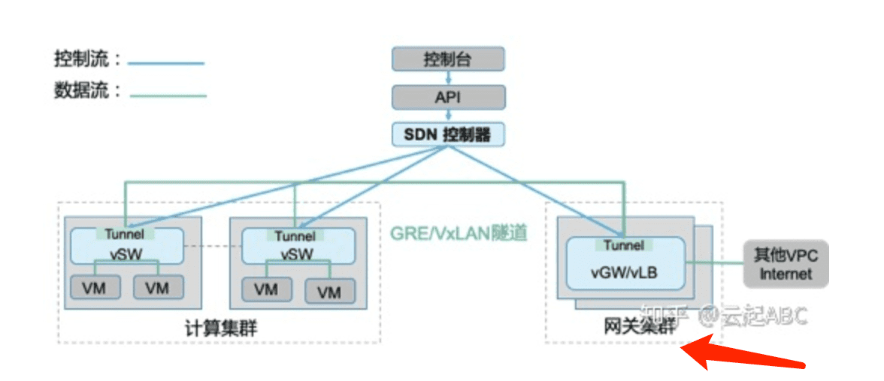

## VPC路由模式
  - 方案说明
    - 按照创建集群时设定的节点长度为节点分配容器子网
    - 每个节点的容器子网路由配置VPC路由器
  - 优势
    - 元隧道开销,转发性能与主机网络持平
    - vpc内节点与容器互通元SNAT,支持源地址保持
  - 劣势
    - 集群规模受限于VPC路由表规格,比如:200
    - 互通性受限
      - 需要通过nodeport对接ELB后端,存在多跳损耗,负载均衡性差
      - 访问OBS或者外网等服务需要SNAT为节点地址
      

**2.** **VPC系统架构**

**如图2，**VPC的实现采用了SDN、NFV，以及Overlay隧道技术，通过三个重要组件功能实现自动化的网络配置管理与调度转发功能。

1） **控制器Controller：**通过北向接口接收上层应用请求，配置 VPC网络管控/转发策略，然后通过南向接口下发配置到vSW和vGW。图中蓝色线是配置下发的控制流，绿色线是数据流。

2） **虚拟网关vGW：**部署在网关服务器集群上的软件实现各种网络功能。根据控制器下发的配置对出VPC（访问其他VPC、Internet等）的流量进行处理与转发。

3） **虚拟交换机vSW：**部署在业务集群服务器上，接收VM的网络数据包，根据控制器下发的配置执行VxLAN/GRE的隧道封装与转发，通过隧道ID（VPCID）实现逻辑隔离。

## VPC路由模式

## ENI/TrunkPort

[参考](https://education.huaweicloud.com/courses/course-v1:HuaweiX+CBUCNXI046+Self-paced/courseware/af81a9458abd4a9389ea7f4279d800eb/4053174eddde4221b4cabb6f676e3427/)

