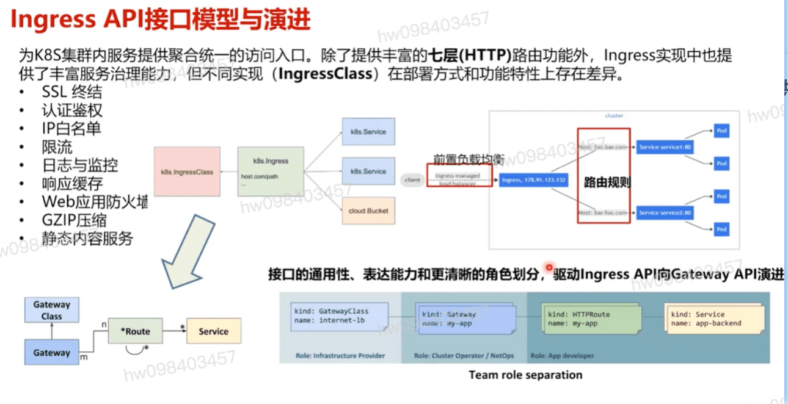
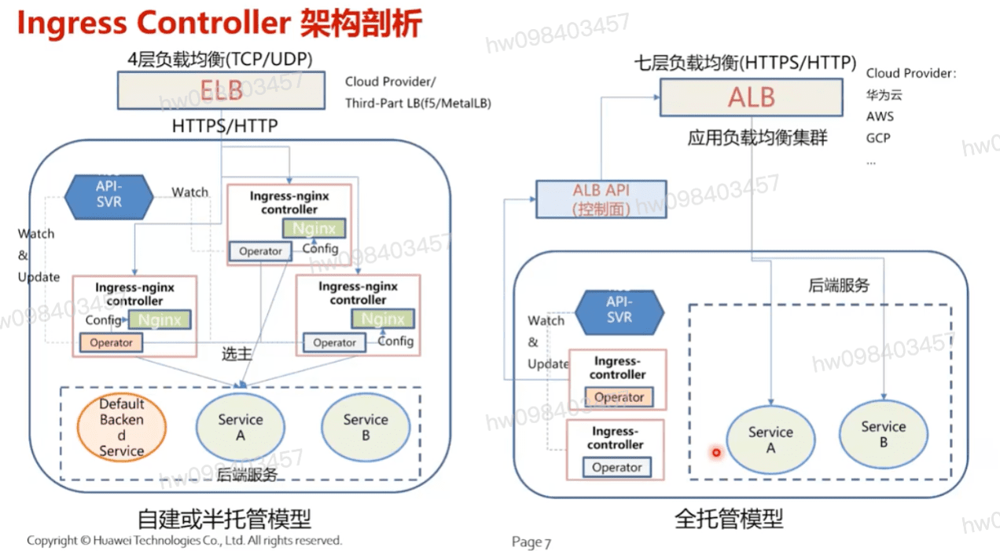

## Ingress API接口模型与演进 
  - **为k8s集群内服务提供聚合统一的访问入口.除了提供丰富的七层(http)路由功能外. Ingress实现中也提供了丰富服务治理能力,但不同实现(IngressClass)在部署方式和功能特性上存在差异**
  - SSL终结
  - 认证鉴权
  - IP白名单
  - 限流
  - 日志与监控
  - 响应缓存
  - Web应用防火墙
  - GZIP压缩
  - 静态内容服务
  - **接口的通用性,表达能力和更清晰的角色划分,驱动Ingress API向Gateway API演进**

## Ingress Controller 架构剖析
  - **自建或半托管模型**
    - **4层负载均衡  + 多ingress-nginx controller**
  - **全托管方式/数据中心方式**
    - **七层负载均衡ALB+ALB(API控制面)+API(SVR)+Ingress+controller**

[参考](https://education.huaweicloud.com/courses/course-v1:HuaweiX+CBUCNXI047+Self-paced/courseware/b5f3529dda3946f0b295f0f1eac9a74b/1762e37b71c44b30b269d82c5ec6b666/)

