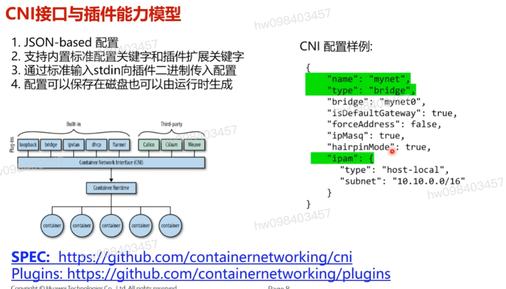
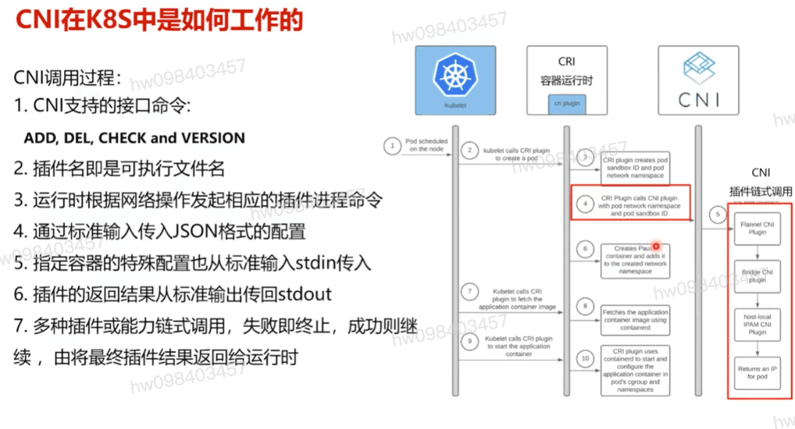
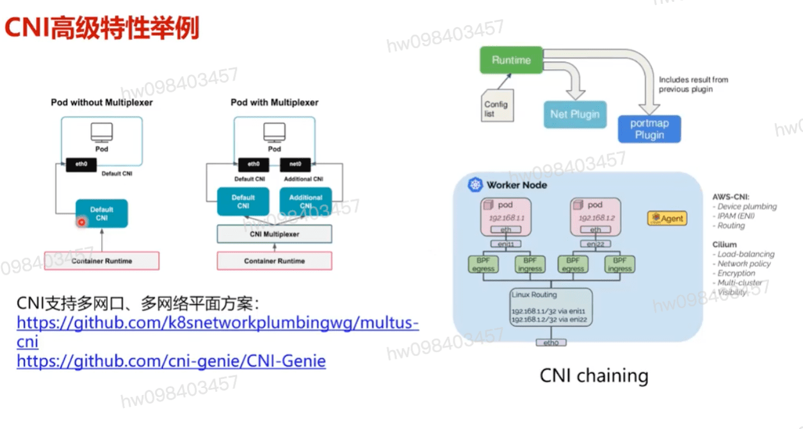

## CNI接口与插件能力模型
  - JSON-based 配置
  - 支持内置标准配置关键字和插件扩展关键字
  - 通过标准输入stdin向插件二进制传入配置
  - 配置可以保存在磁盘也可以由运行时生成
  - built-in 插件
    - loopback
    - bridge
    - ipvlan
    - dhcp
    - flannel
  - third-party
    - Caliko
    - Vmware

## CNI在k8s中是如何工作的
  - CNI支持的接口命令: `ADD` `DEL` `CHECK` `VERSION`
  - 插件名即是可执行文件名
  - 运行时根据网络操作发起相应的插件进程命令
  - 通过标准输入传入JSON格式的配置
  - 指定容器的特殊配置也从标准输入stdin传入
  - 插件的返回结果从标准输出传回stdout
  - 多种插件或能力链式调用,失败即终止,成功则继续,由将最终插件结果返回给运行时

## CNI高级特性 
  - CNI支持多网口,多网络平面方案  **`比如数据清洗`**

[参考](https://education.huaweicloud.com/courses/course-v1:HuaweiX+CBUCNXI047+Self-paced/courseware/b5f3529dda3946f0b295f0f1eac9a74b/6288595728244e6a977a2a8cbb42d136/)

