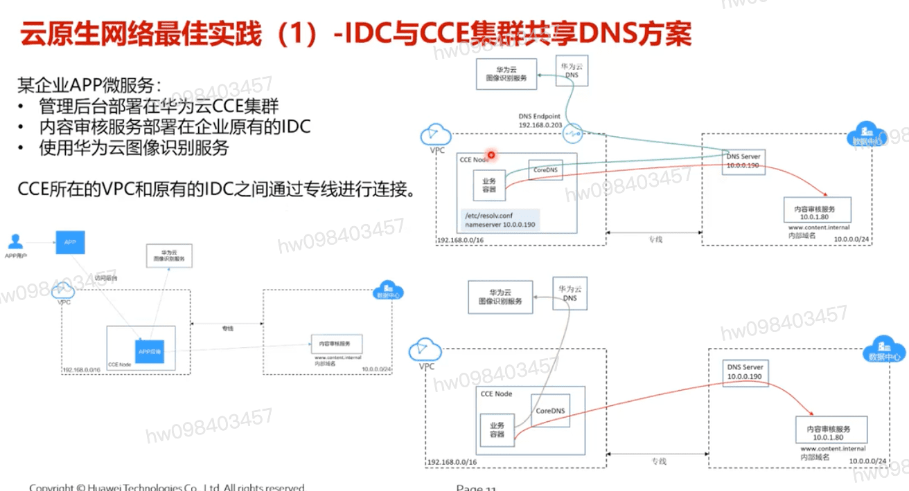
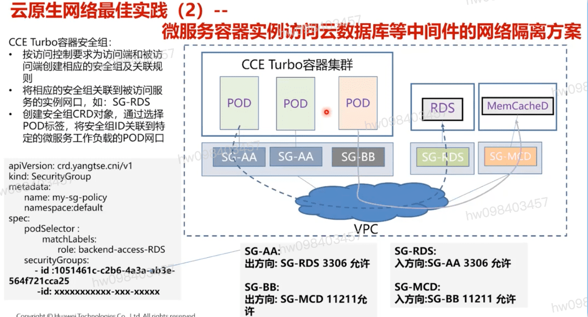
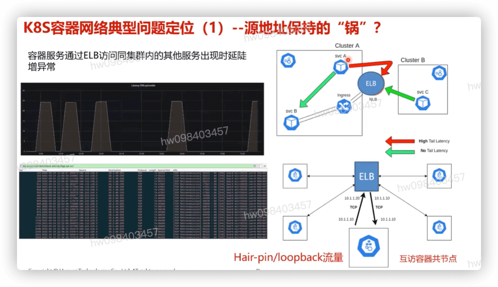
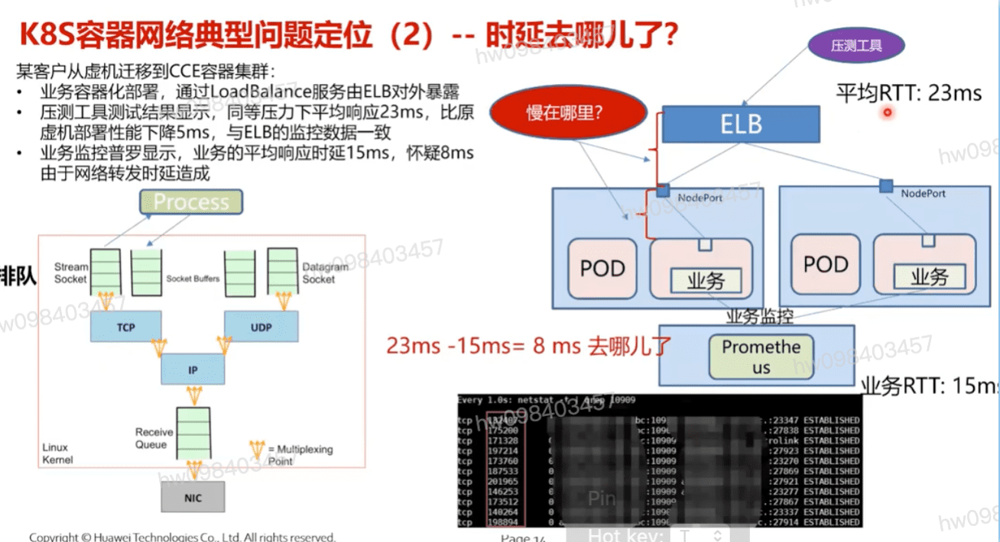

## 某企业APP微服务: `云融合`
  - 管理后台部署在华为云CCE集群
  - 内容审核服务部署在企业原有的IDC
  - 使用华为云图像识别服务
  - **`CCE所在的VPC和原有的IDC之间通过专线进行连接`**

## 微服务容器网络隔离方案

## 案例分析1: k8s容器网络典型问题定位 `时延抖动`

  - `源地址保持` `相同节点` `反亲和`

## 案例分析2: 时延8ms的增加分析 `回应客户质疑` `1ms甚至微秒级的`

  - 最终定位: `业务处理性能`

[参考](https://education.huaweicloud.com/courses/course-v1:HuaweiX+CBUCNXI047+Self-paced/courseware/b5f3529dda3946f0b295f0f1eac9a74b/b303e7c693424ac3bcac02f612c2c0f8/)

