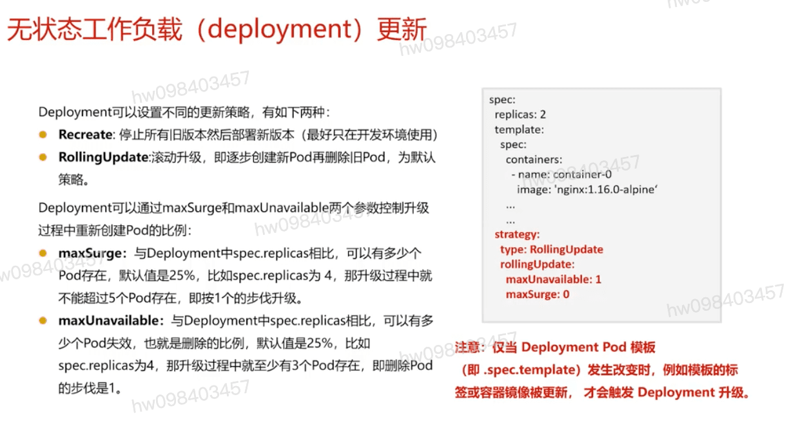

## 无状态工作负载(deployment) 更新 `strategy`
  - Recreate
  - RollingUpdate:滚动升级,默认策略
  - maxSurge: 默认25%
  - maxUnavaliable: 可以有多少个失效 

## 回滚策略示例

## 回滚操作
  - 上一版本: kubectl rollout undo deployment/nginx
  - 回滚到指定版本: kubectl rollout undo deployment/nginx --to-revision=2

