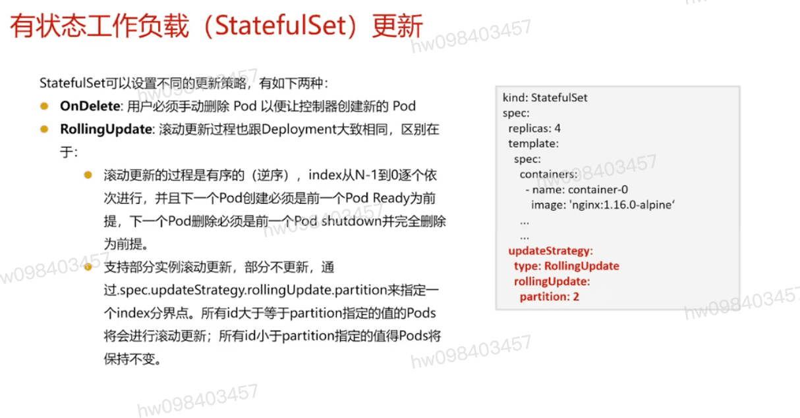

## 无状态工作负载(deployment) 更新 `strategy`
  - Recreate
  - RollingUpdate:滚动升级,默认策略
  - maxSurge: 默认25%
  - maxUnavaliable: 可以有多少个失效 

## 回滚策略示例

## 回滚操作
  - 上一版本: kubectl rollout undo deployment/nginx
  - 回滚到指定版本: kubectl rollout undo deployment/nginx --to-revision=2

## 有状态工作负载(StatefulSet)更新 `updateStrategy`
  - OnDelete: 用户必须手动删除pod以便让控制器创建新的pod
  - RollingUpdate: 滚动更新过程也跟Deployment大致相同,区别在于
    - 滚动更新的过程是有序的(逆序),下一个pod创建必须是前一个pod ready为前提,下一个pod删除必须是前一个pod shutdown并完全删除为前提
    - 支持部分实例滚动更新,部分不更新,通过spec.updateStrategy.rollingUpdate.partition来指定一个index分界点.所有id大于等于partition指定的值的pods将会进行滚动更新;所有id小于partition 指定的值得pods将保持不变

[参考](https://education.huaweicloud.com/courses/course-v1:HuaweiX+CBUCNXI048+Self-paced/courseware/200a2e26f50a492fa016ac65f4cf915a/71a83fdc7c1f494c9eef5f681fb71597/)

1.2 应用探针健康检查机制详解
1.3 应用弹性伸缩原理详解
1.4 课程材料
1.5 随堂测试
课程材料

